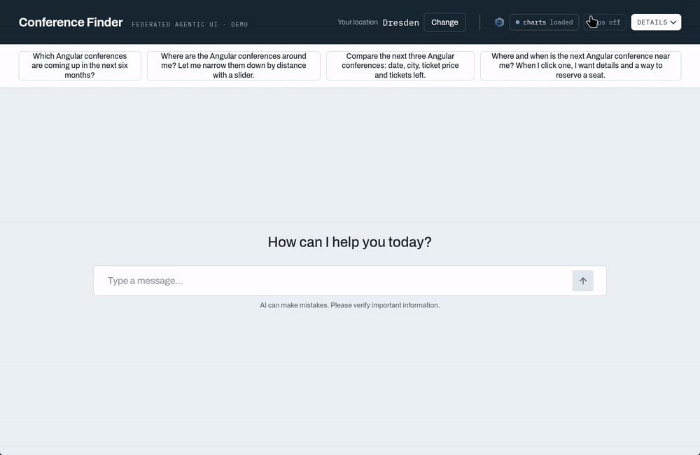
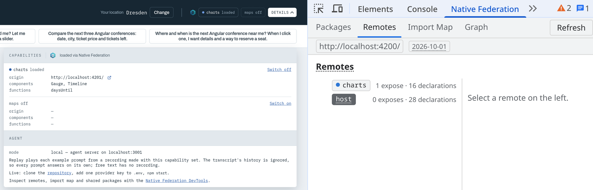
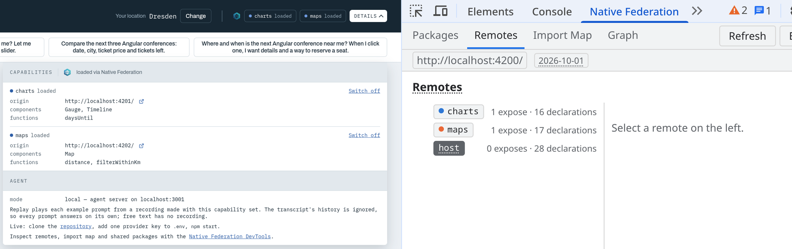

<div align="center">

# Federated Agentic UI

**An LLM composes the UI. Micro frontends deliver the building blocks, at runtime.**

Ask a question, and the LLM composes the UI that fits it best: a tree of
components, wired by data bindings and described in [A2UI](https://a2ui.org).
The result is live. It filters, selects and updates in the browser, without
another call to the LLM or the server. Its building blocks, components and
functions, come from [Native Federation](https://native-federation.com) remotes.
Add a remote and the LLM has more to build with. The shell is not rebuilt.
Demonstrated with ConferenceFinder.

📖 Builds on Manfred Steyer's book **[Agentic UI with Angular][book]**.
The book lays the foundation. This repository adds the federation.




**[Try the hosted demo][demo]** · [How it works](docs/how-it-works.md) · [Architecture](docs/architecture.md)

</div>

> *The maps team ships a new component. Who tells the assistant? And who
> redeploys the shell?*

Nobody. The maps team ships a **capability**: the words the LLM may use, and the
Angular components that draw them, in one remote. Load the remote, and the
assistant can say `Map` and the browser can draw one. Leave it out, and the
assistant tells you what is missing. No shell rebuild, no agent-server deploy.

The request decides which inputs/outputs are composed and how they are wired;
the vocabulary decides what is possible; Native Federation decides who delivers
vocabulary — demonstrated with ConferenceFinder, a chat that answers conference
questions with a timeline, a map or a gauge instead of a paragraph.

## What you see



Left the demo's own panel, right the
[Native Federation DevTools](https://native-federation.com/docs/v4/devtools/).
With charts only, both show one remote. It exposes one module.



After _Switch on_, `maps` appears on both sides, with its `Map` component and
its two functions. Nothing else changed.

- 🧩 **Capabilities from remotes** — `charts` brings `Timeline`, `Gauge` and
  `daysUntil`. `maps` brings `Map`, `distance` and `filterWithinKm`. The shell
  has no vocabulary of its own.
- 🗣️ **A model that names the gap** — ask for a map while only charts is loaded:
  the answer says what it cannot build and shows the best it has.
- 🖱️ **Interaction without the model** — the slider narrows the map, a click
  selects a conference, a reservation drops the gauge. No request is sent.
- 🔌 **Remotes switched by URL** — `?capabilities=charts` narrows what the
  manifest lists. The header shows every remote as _loaded_, _unreachable_ or
  _off_.
- 📼 **A hosted demo without a key** — sixteen recorded answers, played through
  the real tools and the real renderer, on today's data.
- 📏 **Checked, not assumed** — module boundaries by Sheriff, model behavior by
  an eval gate against the real LLM.

## A capability in 30 seconds

A capability is what one team contributes to the assistant, for example "maps".
It is one object with two halves, and they travel to two different consumers:

```ts
// what the maps team ships — simplified
export const capability = {
  name: 'maps',

  // Half 1 → the LLM: which components and functions exist, what their props mean
  vocabulary: {
    components: { Map: { description: 'Shows items that have lat/lon …', schema: mapProps } },
    functions: [distance, filterWithinKm],
  },

  // Half 2 → the renderer: an Angular component for every name above
  components: { Map: MapComponent },
};
```

- **`vocabulary` goes to the model.** The shell turns it into JSON and sends it
  with every chat request. The agent server pastes it into the system prompt.
- **`components` go to the renderer.** The shell registers them in the catalog
  of the A2UI renderer: a lookup from name to Angular component.
- **One name union couples them.** A word without a component does not compile.
  A component without a word does not compile either.

→ [How it works](docs/how-it-works.md) explains the idea without opening any
code.

## Quickstart

### The hosted demo

**[Open the demo][demo].** It needs no API key: it plays recordings, one for
every example prompt and every combination of remotes.

1. Open it with charts only (`?capabilities=charts`) and click the second
   example prompt. The assistant says it cannot wire up a distance slider and
   shows a plain list.
2. Open _Details_ in the header and switch maps on. Click the prompt again: a
   map, and the slider narrows it.

Between the two steps nothing changed except what was loaded. A question you
type yourself has no recording; for that you need the local setup.

→ [The hosted demo is a recording](docs/how-it-works.md#the-hosted-demo-is-a-recording)

### Run it locally

```bash
npm install
cp .env.example .env    # put in the key of one provider
npm start               # shell 4200, charts 4201, maps 4202, agent 3001
```

Then open http://localhost:4200 and ask freely, within what the search offers:
topics, a date window and the distance from your location. Requires Node.js
>= 24.

→ [Development](docs/development.md) has the setup details, every script, the
deploy build and the checklist for a third remote.

### Status

The demo is complete. The shell is a Native Federation dynamic host. `charts`
and `maps` are remotes on their own ports that contribute the assistant's
vocabulary at runtime. The agent server is a thin Mastra agent behind AG-UI.
Shell, remotes and agent server share this one workspace, which is
[a simplification](docs/how-it-works.md#the-monorepo-is-a-simplification).

Who answers the chat is decided at startup: a real LLM behind the local agent
server (`?agent=local`, the default of `npm start`), or the recordings
(`?agent=replay`, the default of the deployed site).

→ [Agent modes: local and replay](docs/architecture.md#agent-modes-local-and-replay)

## A deliberately small domain

Nobody needs an AI-composed conference finder. The domain is deliberately small
so the mechanism stays visible.

## FAQ

Every answer is short on purpose. The link below it leads to the place where the
rule is written down in full.

### For the skeptic

**Is a conference finder a realistic use case?**

No, and that's the point. Thirty conferences and three custom components are
small enough to watch the mechanism work: a remote arrives, the assistant
learns a word, the browser can draw it.
→ [Where this pays off](#where-this-pays-off)

**Would this work without Native Federation?**

Yes. Everything in this workspace could be built without it: shell and remotes
share one repository to keep the demo small. Native Federation pays off when
remotes do _not_ share a repository: other teams, other release cycles, other
servers. What already holds here: the remotes are loaded at runtime across
origins, and the module boundaries keep each remote repo-portable.
→ [The monorepo is a simplification](docs/how-it-works.md#the-monorepo-is-a-simplification)

**What changes when a new team delivers a capability, and what does not?**

One manifest entry changes. The shell is not rebuilt, the agent server is not
redeployed, and neither of them is even told. Here the manifest is a static
JSON file next to the shell; in a real setup it is a discovery service. The
checklist under [Adding a remote](docs/development.md#adding-a-remote) is longer only because the
remote lives in this workspace.
→ [One remote, both halves](docs/how-it-works.md#one-remote-both-halves)

**Why a reload instead of hot-add?**

Which remotes are loaded is decided once, before Angular starts, and stays
fixed for the lifetime of the page. The URL is the only source of that
selection, so it is always visible and you can share it. And a conversation
never changes its vocabulary halfway.
→ [Federation and boundaries](docs/architecture.md#federation-and-boundaries)

**How do you know the model does this reliably?**

I measure it. `npm run eval` plays the example prompts against the real LLM,
five runs each, with both remotes and with charts only; every request has to
pass 4 of 5. The hard case asks for the slider map while no map is loaded: it
passes only if the answer uses nothing outside the announced vocabulary and
names the gap. The result still depends strongly on the model and on the
prompt.
→ [The model-behavior gate](docs/development.md#the-model-behavior-gate)

### For the agentic-UI reader

**How does Mastra talk to Angular?**

Through AG-UI: one POST goes in and one SSE stream comes back, per run. Mastra
does not speak AG-UI itself, the `@ag-ui/mastra` adapter translates. In the
browser CopilotKit maps a tool call by name to our handler. The A2UI message
rides inside that tool call, as the arguments of `renderSurface`.
→ [One AG-UI run](docs/architecture.md#one-ag-ui-run)

**Does the agent server know the components?**

No. The server holds no vocabulary. It owns only the fixed part of the system
prompt: the message format, the binding rules and two examples built from basic
components. Which components and functions exist arrives from the browser with
every request, and a spec guards that the prompt names none on its own.
→ [Prompt and vocabulary](docs/architecture.md#prompt-and-vocabulary)

**What stops the model from inventing components?**

The prompt tells it to use only what is listed. It can happen anyway. So the
shell checks every answer against its catalog before it draws anything: an
unknown name is rejected, the surface is rolled back, and the LLM gets the
reason back as the tool result. It has three corrections per user turn, then
the shell stops.
→ [The renderSurface round trip](docs/architecture.md#the-rendersurface-round-trip)

**Who supplies the data?**

Structure from the model, data from code. The search runs in the browser as a
client tool and puts its result into the data model of the surface. The LLM
only writes where the data is, `{ "path": "/filteredConfs" }`. It is told how
many hits there are and what the first one is, never the list.
→ [Data stays in the browser](docs/how-it-works.md#data-stays-in-the-browser)

**Why not CopilotKit's built-in A2UI path?**

CopilotKit ships one: a built-in `render_a2ui` tool on a Lit renderer. This
demo bypasses it deliberately. Its tool is `renderSurface` on `@a2ui/angular`,
the renderer that creates a remote's plain Angular components inside the
shell's component tree, with our own guards in front of it.
→ [Layers and ownership](docs/architecture.md#layers-and-ownership)

**What about i18n?**

The shell is English. The LLM is told to write the labels inside a surface in
the language the user writes in. There are no translation files.
→ [Prompt and vocabulary](docs/architecture.md#prompt-and-vocabulary)

### For the Native Federation reader

**How are the module boundaries enforced?**

With Sheriff, three rules, on every `npm run lint`. The shell imports the
contract, never a remote's source. A remote imports the contract only: not the
shell, not another remote. The contract imports nothing of ours.
→ [Federation and boundaries](docs/architecture.md#federation-and-boundaries)

**What if a remote is unreachable?**

The app still starts, with the remaining vocabulary. A remote that fails to
load is logged and left out; the import of its `./capability` module has a 15 s
timeout. The header shows it as _unreachable_, because a failed remote must not
look like one that was switched off.
→ [Boot: the shell loads its remotes](docs/architecture.md#boot-the-shell-loads-its-remotes)

**How does it stay one zod and one Angular across the boundary?**

All three federation configs share Angular as `singleton` with `strictVersion`.
The renderer creates a remote's components inside the shell's component tree,
so a second Angular would mean a second DI tree. The price: shell and remotes
upgrade Angular in step. For zod, only the `zod/v3` line crosses the boundary;
the root `zod` is not shared.
→ [Federation and boundaries](docs/architecture.md#federation-and-boundaries)

**Can a remote run alone?**

Yes. Each remote is also a standalone page that renders its components without
the shell. The data there is deliberately not conferences: the charts page
shows release milestones, the maps page shows lighthouses.
→ [Big picture](docs/architecture.md#big-picture)

**How does the design stay consistent across teams?**

The shell sets CSS custom properties, the remotes consume them. A remote never
imports CSS of the host. Its components read the tokens with the token's own
value as fallback, so they look right even in a host that declares none.
→ [Federation and boundaries](docs/architecture.md#federation-and-boundaries)

**A team swaps its implementation: does the model notice?**

No. The LLM reads the vocabulary, never the implementation. The maps remote
draws a real map with MapLibre today; before that it was a plain SVG drawing,
and the shell did not notice the change. The eval gate reads only the
vocabulary files, so the same vocabulary gets the same verdicts.
→ [How the shell finds its remotes](docs/how-it-works.md#how-the-shell-finds-its-remotes)

### For the architect

**A remote writes text into the system prompt: a risk?**

Yes, and it is the one new path. A remote is fully trusted code anyway, so the
trust boundary is the manifest. New is that a remote's descriptions reach the
LLM. The damage is bounded here because the agent server has no tools.
→ [Not production-ready: what a real deployment needs](docs/production-readiness.md)

**How do you steer capabilities per role or user?**

With a filtered manifest. The manifest is the ceiling of what a page can load,
and the URL can only narrow it. Serve the manifest from an endpoint that knows
the user, and a remote the user may not have is neither loaded nor announced
nor rendered. This is described, not built.
→ [Federation and boundaries](docs/architecture.md#federation-and-boundaries)

**What does a run cost, and the eval?**

An answer takes one or two model calls: the search, then the surface. A wrong
surface adds up to three correction runs. Every request carries the custom
vocabulary in the system prompt, about 14 000 characters for the three custom
components. The eval is about 20 requests per run. The hosted demo costs
nothing: no model is called.
→ [The model-behavior gate](docs/development.md#the-model-behavior-gate)

## Where this pays off

And where it does not.

The criterion is not "lots of data". It is unpredictable questions against
structured data that has many forms of presentation.

- **The natural home is BI, dashboards and internal cockpits.** Cross-filtering
  is the selection mechanism you see in the demo. Several teams own
  visualizations. And the model does not read the data set.
- **It does not fit fixed processes and form flows.** There the hand-built
  screen wins.
- **Go in stages.** First natural language as a command layer over the existing
  UI: tool calls, no A2UI. Then generative composition, and only where the
  presentation is really open.

The rule: several teams, requests that cut across them, UIs nobody built in
advance. If one of the three is missing, a widget tool is enough.

## Not production-ready

This is a demo. A remote is fully trusted code, the agent endpoint has no
authentication, and nothing limits cost or topic.

→ [What a real deployment needs](docs/production-readiness.md): what is built,
what is missing, and why SRI is not switched on.

## Background and credits

The base architecture follows the book [Agentic UI with Angular][book] by
Manfred Steyer. This repository adds Native Federation as the delivery
mechanism, the two-halved capability contract, enforced boundaries and the eval
gate.

Developed by [Lutz Leonhardt](https://lutzleonhardt.de). Built in an agentic
workflow with coding agents as pair programmers; architecture, review and
verification stay with the maintainer. [`docs/work/`](docs/work/) holds the
plans and task logs on purpose, as a showcase of that workflow.

## Documentation

- [How it works](docs/how-it-works.md) — the idea: what a capability is and why
  its two halves travel to two different consumers
- [Architecture](docs/architecture.md) — the reference: the big picture, the
  AG-UI run, who owns which layer, and the invariants
- [Development](docs/development.md) — setup, scripts, adding a remote, and the
  eval gate that measures the model
- [Not production-ready](docs/production-readiness.md) — what a real deployment
  needs

## License

MIT — see [LICENSE](./LICENSE).

[demo]: https://lutzleonhardt.de/conference-finder/
[book]: https://knowhow.angulararchitects.io/
