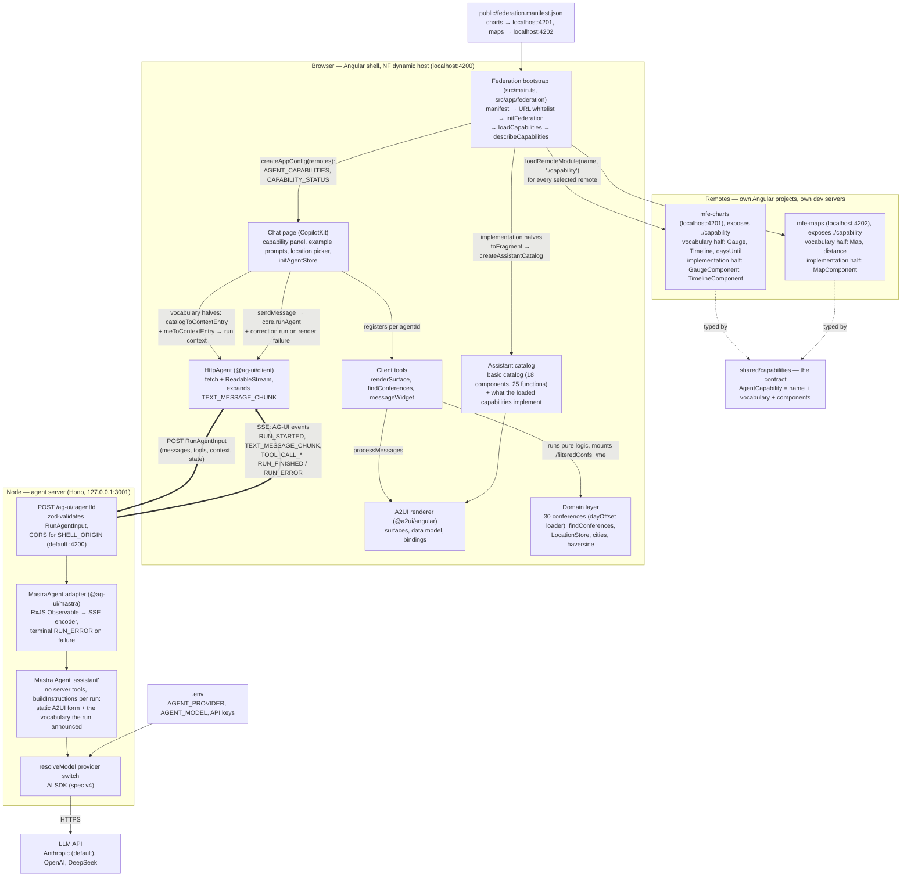
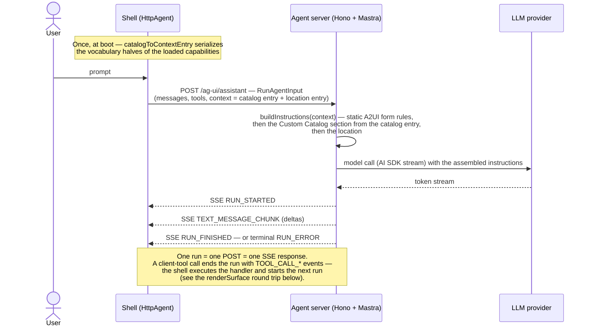
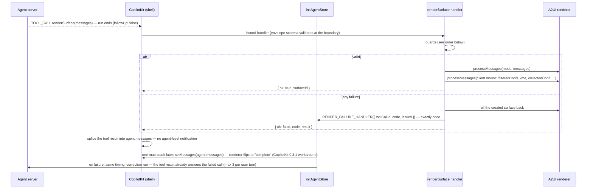

# Architecture

The request decides which inputs/outputs are composed and how they are wired;
the vocabulary decides what is possible; Native Federation decides who delivers
vocabulary. An AG-UI agent answers conference questions, and the answer is
rendered as an A2UI surface built from a component vocabulary that remotes
contribute at runtime, rather than from hand-written screens.

This document is the reference: dense on purpose, meant to be searched rather
than read top to bottom — by whoever changes the code next, human or coding
agent. For the idea behind it, read [`docs/how-it-works.md`](./how-it-works.md)
first.

Everything described here exists in the code; what is planned but not built is
named only in *Status and history*. The chat page at `/` is the visual anchor,
with the capability panel in its header; the playground routes stay as dev
sandboxes: `/playground` (catalog components on a hand-built surface) and
`/playground/tools` (the real client-tool pipeline).

## How to read this document

It has three parts. *Big picture* is the map. *At runtime, in order* follows the
app from page load through one chat turn. The rest is lookup material: who owns
which layer, what must stay true while you change code, how model behaviour is
measured, and where the project stands.

| You want to know | Read |
| --- | --- |
| Which parts exist, and where the components come from | [Big picture](#big-picture) |
| What happens before the first message | [Boot](#boot-the-shell-loads-its-remotes) |
| What happens when the user sends a message | [One chat turn](#one-chat-turn-in-plain-words), then its two details: [One AG-UI run](#one-ag-ui-run) and [The renderSurface round trip](#the-rendersurface-round-trip) |
| Which package does what, and which of our files patches which upstream gap | [Layers and ownership](#layers-and-ownership) |
| What you must not break | [Invariants worth knowing](#invariants-worth-knowing), grouped by area |
| How model behaviour is measured | [The eval harness](#the-eval-harness) |
| What is done, what comes next, and where the reasons are recorded | [Status and history](#status-and-history) |

## Big picture

The map: every part that exists, who talks to whom, and the path of the two
halves of a capability — the implementation half into the renderer's catalog,
the vocabulary half through the agent server into the model's prompt.

A remote's `./capability` module is fetched from the remote's origin and runs
inside the shell's page. It is the only thing a host imports from a remote, and
it carries both halves of the capability:

| Capability | Remote | Vocabulary half → the model | Implementation half → the renderer |
| --- | --- | --- | --- |
| `charts` | `mfe-charts`, port 4201 | `projects/mfe-charts/src/charts/vocabulary.ts`: `Gauge`, `Timeline`, function `daysUntil` | `projects/mfe-charts/src/capability.ts`: `GaugeComponent`, `TimelineComponent` |
| `maps` | `mfe-maps`, port 4202 | `projects/mfe-maps/src/maps/vocabulary.ts`: `Map`, function `distance` | `projects/mfe-maps/src/capability.ts`: `MapComponent` |

The vocabulary half is framework-free: names, descriptions, prop schemas, and
the catalog functions whole (a function's description and argument schema go to
the model, its implementation into the catalog). The implementation half is the
Angular components. The model gets the vocabulary half alone; the renderer gets
both, joined by `toFragment`: every catalog entry carries name, description and
schema next to its component, and the renderer validates props with that schema. Each remote is also a standalone page on its own port — an
A2UI host built from the basic catalog plus exactly its capability, without any
shell helper.

## At runtime, in order

Four steps in time order: the boot happens once per page load, the chat turn is
the overview of everything after it, and the last two sections zoom into the two
halves of that turn.

### Boot: the shell loads its remotes

Once per page load, before Angular starts (`src/main.ts`). What this decides is
fixed for the app's lifetime.

1. Fetch `federation.manifest.json` — the ceiling of what this deployment can
   load. Here it is a static file in `public/`; an endpoint could serve it just
   as well. If it is unreachable the manifest counts as empty.
2. `selectCapabilities` narrows it to the `?capabilities=` whitelist (invariant
   *The manifest is the ceiling, the URL a whitelist*).
3. `initFederation(selected)` installs the import map. Only now can the browser
   resolve shared packages such as Angular, so `main.ts` imports nothing from
   `@angular/*`; Angular enters through the dynamic `import('./bootstrap')` at
   the end.
4. `loadCapabilities` imports `./capability` from every selected remote in
   parallel, each with a 15 s timeout, and checks the delivered shape at runtime.
   A remote that stalls, fails or exposes no usable capability is logged and
   left out — the shell still starts with the remaining vocabulary.
5. `describeCapabilities` yields one `CapabilityStatus` per manifest entry:
   `loaded` (with the origin the orchestrator reports), `unreachable` or
   `unselected`. Three states on purpose: a remote that failed must not look
   like one that was switched off in the URL.
6. `createAppConfig(remotes)` provides that list twice: `AGENT_CAPABILITIES`
   (the loaded ones, for the catalog and the model context) and
   `CAPABILITY_STATUS` (every entry, for the capability panel). The panel's
   links reload the app with one remote flipped in the URL.

Not switched on: subresource integrity. Native Federation can hash what a remote
delivers (`features.integrityHashes`, manifest entries with an `integrity`
value); all three `federation.config.mjs` files leave it off.

### One chat turn, in plain words

The whole turn in six steps. *One AG-UI run* below is the detail of steps 1–2,
*The renderSurface round trip* the detail of steps 3–6.

1. The user asks — CopilotKit sends the prompt through our agent server to
   the LLM, together with the vocabulary of the loaded capabilities.
2. The LLM answers: "call `renderSurface` with these messages." It knows only
   tool names and schemas and the vocabulary this run announced — nothing else
   of our world.
3. CopilotKit looks the name up in its registry and finds our handler plus our
   display component — both handed over once, at registration
   (`createFrontendTool`).
4. The handler validates the messages, builds the surface in the root renderer
   service, and mounts our data behind the bound paths.
5. CopilotKit places the display component at the tool call's spot in the chat
   transcript: "Building surface …" while streaming, then the surface — or the
   error text.
6. The turn ends (`followUp: false`). On failure, `RENDER_FAILURE_HANDLER`
   carries the one signal; `initAgentStore` starts the correction run once the
   failed call has its result — the tool result itself tells the model what
   went wrong. Three corrections per user turn, then the shell stops.

### One AG-UI run

Steps 1–2 in detail: what travels to the agent server and how the prompt comes
about. The vocabulary section of the system prompt is not written anywhere: the agent
server assembles it per run from the context the shell sends. The same request
is therefore a different run per capability set.

The model learns three things from three sources. The static part of the prompt
(`agent/src/prompt.ts`) teaches A2UI form. The `context` field carries the
vocabulary of the loaded capabilities and the user's location. The `tools` field
carries the client tools CopilotKit registered (`renderSurface`,
`findConferences`, `messageWidget`: name, description, parameter schema); the
`@ag-ui/mastra` adapter hands them to Mastra as `clientTools`, so the model sees
them as tool definitions, never as prompt text.

What the model reads under `# Custom Catalog`, per shell URL:

| URL | Loaded | The section lists |
| --- | --- | --- |
| `/` or `/?capabilities=charts,maps` | charts, maps | `Gauge`, `Timeline`, `Map`, `daysUntil`, `distance` |
| `/?capabilities=charts` | charts | `Gauge`, `Timeline`, `daysUntil` |
| `/?capabilities=` | — | an empty catalog: `components: {}`, `functions: {}` |

The shell always sends a catalog entry, so the prompt's fallback text ("No custom
vocabulary available …") appears only for a client that sends none.

The static part of the prompt tells the model that the vocabulary changes
between conversations and how to answer a request no listed component provides:
a `messageWidget` text that names the missing capability, plus a `renderSurface`
call with the best available representation in the same assistant message. A
name the run did not announce never reaches the screen either way — the shell's
catalog lacks it, so guard 4 below rejects the surface.

### The renderSurface round trip

Steps 3–6 in detail: what the shell does with the model's answer, and what
happens when that answer is wrong.

A tool call whose handler runs entirely in the browser, guarded before anything
mutates, with a single failure signal feeding the correction loop. The two
steps after the handler both live in `initAgentStore`, both deferred by one
macrotask because CopilotKit splices the tool result only after the handler has
returned.

Guard order and failure codes (each also the model-facing feedback):

1. Protocol envelope at the tool boundary — message forms and required fields
   live in the tool schema itself → `invalid_args`.
2. Cross-message checks: exactly one `createSurface`, every message on its
   surfaceId, no `deleteSurface`, id not already taken → `invalid_messages`.
3. Client-owned paths (`/filteredConfs`, `/me`, `/byMonth`, `/byTopic`) are
   never model-written — decided on parsed path segments, so `me` equals
   `/me`, and root writes are forbidden as a whole → `forbidden_model_writes`.
4. Component names and function calls must exist in the surface's catalog — the
   basic catalog plus what this shell instance loaded (the renderer would
   silently skip unknown ones) → `catalog`.
5. `processMessages` + client mount run in one try/catch; a throw rolls the
   surface back → `catalog`.

## Layers and ownership

Several protocols and toolkits stack on top of each other. The table pins who
owns which layer; the list below it names, per layer, the seam code we wrote and
the verified upstream gap it compensates (where the evidence is recorded: see
*Status and history*).

| Layer | Package(s) | Responsibility | Framework-bound? |
| --- | --- | --- | --- |
| LLM | Anthropic (default), OpenAI, DeepSeek via AI SDK | generate text and tool calls | no |
| Agent runtime | `@mastra/core` | the `assistant` agent in the Node process: instructions, model wiring | no (server-side) |
| Transport | `@ag-ui/core`/`encoder`/`mastra` (server), `@ag-ui/client` (browser) | **AG-UI**: one protocol between any agent backend and any frontend — `RunAgentInput` in, event stream out; the adapter translates Mastra's stream, `HttpAgent` consumes it | framework-free |
| Chat & tools | `@copilotkit/angular` | chat UI, agent store, frontend-tool registration on top of AG-UI | Angular binding |
| Surface protocol | `@a2ui/web_core` | **A2UI**: surface messages, data model, path bindings, the catalog contract (name + schema); even its reactivity is neutral (`@preact/signals-core`) | framework-free |
| Surface renderer | `@a2ui/angular` | binds the catalog contract to Angular components (`BoundProperty` signals, `a2ui-v09-surface`) | Angular binding |
| Vocabulary | `shared/capabilities/` (contract), `projects/mfe-charts/`, `projects/mfe-maps/` (the capabilities), `src/app/a2ui/` (merge + model context) | the assistant catalog: framework-free metadata (`*.schema.ts`, catalog functions) + Angular implementations, contributed per remote | split on purpose |
| Federation | `@angular-architects/native-federation-v4`, `@softarc/native-federation-orchestrator` | **Native Federation**: load a remote's ES module at runtime through an import map and negotiate the shared packages | runtime framework-free, Angular builder |

Our seam code, per layer, and why it exists (the LLM layer has none, the
Vocabulary layer is our code as a whole):

- **Agent runtime**
  - `resolveModel` — the `.env`-driven provider switch.
  - `buildInstructions` — the adapter parks the run's AG-UI context under the
    `ag-ui` key and nothing in Mastra reads it, so the prompt is assembled from
    it per run (dynamic `instructions`, resolved on every `getInstructions`).
- **Transport**
  - The route zod-validates `RunAgentInput` and pins CORS to `SHELL_ORIGIN`.
  - The shell pins `@ag-ui/*` to CopilotKit's exact version (one `AbstractAgent`
    class).
  - A `uuid` browser-build alias in the test runner.
- **Chat & tools**
  - `createFrontendTool`/`bindFrontendTool` — CopilotKit only JSON-parses tool
    args, so the boundary validates here; adds the turn-end suffix and routes
    boundary rejections into `RENDER_FAILURE_HANDLER`.
  - `initAgentStore` — registers tools and context for one agent, re-publishes a
    turn-ending tool's result to the store (CopilotKit splices it in silently),
    and defers the correction run until that result exists.
- **Surface protocol**
  - The `renderSurface` guards — the wrapper schema validates messages only one
    by one, so the cross-message rules (one fresh surface, no `deleteSurface`,
    segment-based forbidden writes, rollback on failure) live in the handler.
- **Surface renderer**
  - `provideA2uiCatalog` — action-bus wiring plus the `MarkdownRenderer` the
    basic `Text` injects but `provideA2Ui` does not provide.
  - `createCustomComponent`/`createCatalogFunction` — the two documented
    zod-universe bridge casts; add the `description` their `ComponentApi` lacks.
- **Federation**
  - The two-phase bootstrap (`src/main.ts` → `src/bootstrap.ts`).
  - `selectCapabilities` — the URL whitelist.
  - `loadCapabilities` — timeout plus a runtime shape check, because the
    contract's compile-time pairing of names and implementations cannot cross
    the federation boundary.
  - `describeCapabilities` — the three states the panel shows.

How they interlock: A2UI never touches the wire on its own — it rides **inside**
AG-UI, as the arguments of the `renderSurface` client tool call. CopilotKit
renders the chat transcript and routes the tool call to our handler, which
validates the A2UI payload and hands it to the `@a2ui/angular` renderer; the
surface then appears inline in the chat as that tool call's rendering. The
model authors only the structure — the data behind the bound paths is mounted
by the client (see the invariants below).

CopilotKit does ship its own A2UI path (a built-in `render_a2ui` tool on a Lit
renderer). We bypass it deliberately — our tool is `renderSurface` on
`@a2ui/angular` — and the tool names `render_a2ui` and `AGUISendStateSnapshot`
stay reserved to CopilotKit.

## Invariants worth knowing

Each rule is stated once, here, grouped by the area you are about to change.

### Prompt and vocabulary

What the model may know, and where it learns it.

- **The server holds no vocabulary.** It teaches A2UI *form* — the prompt carries
  the message envelope, the binding syntax and two worked examples built from
  basic components only — but never learns which components exist: that reaches
  the model only through the catalog context entry the browser sends per run.
  `agent/src/prompt.spec.ts` guards it: the prompt built without a catalog entry
  names no custom component or function. Surfaces are built by the model and
  rendered in the browser via the `renderSurface` client tool; no server tool
  touches a surface.
- **The browser owns the data, the model only binds to it.** The client mounts
  `/filteredConfs`, `/me` (and derived views) into the surface data model — the
  `renderSurface` handler does it with `updateDataModel` messages when the
  surface is created; the model binds paths instead of transcribing values.
  These paths are never written by the model.
  `/filteredConfs` holds the latest search result when the surface is created;
  `/selectedConf` holds that surface's selection, initially the first result.
- **One enumeration per capability.** A remote's `vocabulary.ts` names the
  components and functions it contributes; its `capability.ts` pairs the same
  names with Angular components, and the shell's `catalog-context.ts` serializes
  them for the model. Both halves are keyed by one name union, so an announced
  component without an implementation (or the reverse) is a compile error inside
  the remote; `loadCapabilities` repeats the check at runtime for what arrives
  over the federation boundary. Which capabilities are loaded is decided by the
  federation bootstrap (`createAppConfig(remotes)`), never by an import in the
  shell; `AGENT_CAPABILITIES` is where the rest of the app reads that list.

### Surfaces and tools

The path of a `renderSurface` call. Most of these compensate a verified CopilotKit behaviour, so re-check them on an upgrade.

- **The tool boundary validates because CopilotKit does not.** CopilotKit only
  JSON-parses tool arguments; the schema in `parameters` never runs. Every tool
  therefore goes through `createFrontendTool`, whose bound handler parses the
  arguments before any tool code sees them.
- **One fresh surface per call.** The model never edits or deletes an existing
  surface: `deleteSurface` is rejected, taken surfaceIds are refused. Surfaces
  in the chat history stay immutable.
- **Exactly one failure signal per failed call.** `followUp` is static, so a
  failed `renderSurface` cannot ask for a correction itself;
  `RENDER_FAILURE_HANDLER` fires exactly once per failure (boundary rejections
  included) and is the whole correction channel.
- **A correction run answers the failed call first.** `RENDER_FAILURE_HANDLER`
  fires inside the failing tool call, before CopilotKit has spliced the tool
  result into the transcript; `initAgentStore` defers the correction run until
  that result exists, so the model never sees an unanswered tool call (specs in
  `src/app/chat/chat.page.spec.ts` pin the order). Failures of one run share one correction, and
  three corrections per user turn are the budget — each is a top-level run,
  outside CopilotKit's follow-up depth limit.
- **Turn-ending tool results reach the store by hand.** CopilotKit splices a
  tool result into `agent.messages` without an agent-level notification, so
  after a `followUp: false` tool the agent store — and the tool renderer's
  status — would only catch up on the next run. `initAgentStore` re-publishes
  the messages after `onToolExecutionEnd`.

### Federation and boundaries

What keeps a remote loadable, replaceable and movable.

- **The manifest is the ceiling, the URL a whitelist.** `?capabilities=charts,maps`
  can only narrow `federation.manifest.json`, never add a remote the manifest
  does not carry: no parameter keeps every entry, an empty one keeps none,
  unknown names are ignored. The URL is the selection's only source — no
  localStorage, no in-app state — so it stays visible, shareable and
  unit-testable, and switching a remote is a reload. Manifest order is kept
  because it decides who wins a duplicate name: first registration wins, by the
  same rule in the catalog merge and in the context serializer, so the announced
  schema is the rendered one.
- **Three module boundaries, checked by `npm run lint`.** The shell imports the
  contract and `shared/agent-contract.ts`, never a remote's source. A remote
  imports the contract only — not the shell, not another remote, not the agent
  contract. The contract imports nothing of ours. `sheriff.config.ts` is the
  executable form; Sheriff walks from the production entry points, so the rules
  bind production code and a shell spec may import a remote's source as a
  fixture. The package half lives in `eslint.config.js`: remote production code
  may not import `@copilotkit/*` or `@ag-ui/*` — a remote is an A2UI capability,
  not an agent client.
- **One Angular for shell and remotes.** The renderer creates a remote's
  components inside the shell's component tree, so they share its injector and
  change detection. All three federation configs therefore share Angular as
  `singleton` with `strictVersion`; a second Angular instance would mean a
  second DI tree and no binding across the boundary. The price is that shell and
  remotes upgrade Angular in step.
- **Remotes stay repo-portable.** A remote depends on the contract folder and on
  published packages, on nothing else, so it could move into its own repository
  on its own server tomorrow — the boundaries above exist to keep that true.
  That is why `mfe-maps` carries its own haversine copy (`maps/geo.ts`) instead
  of importing the shell's domain layer; the specs pin both copies to the same
  measured distance. What the single workspace simplifies
  compared with that real shape is argued once, in
  [`how-it-works.md`](./how-it-works.md#the-monorepo-is-a-simplification).
- **The capability contract is `shared/capabilities/`.** It is this project's own
  contract, not part of A2UI or AG-UI. Everything a remote needs
  to describe a capability (`AgentCapability`, `CapabilityVocabulary`, the
  schema helpers, `dispatchSurfaceAction`) lives there; the shell keeps only
  the merge (`assistant-catalog.ts`) and the model context. The Node rule holds
  per file, not per folder: `surface-action.ts` needs Angular at runtime, and
  an ESM import evaluates every module a barrel re-exports (tree-shaking is a
  bundler step, Node has none), so there is no `index.ts` and a `vocabulary.ts`
  must never reach it.
- **The shell/agent/eval contract is one file.** Agent id, port, route shape and
  the two context-entry descriptions live in `shared/agent-contract.ts`, which
  all three projects import; it stays import-free because it has to load under
  three module resolutions (Angular bundler, the agent's `nodenext`, eval). The
  specs that assert the literal values are the place where a rename is decided.

### Transport and server

The wire between the browser and the agent server.

- **The wire carries chunks.** Assistant text arrives as `TEXT_MESSAGE_CHUNK`;
  the expansion to `TEXT_MESSAGE_START/CONTENT/END` happens in the client's
  `runAgent` pipeline, not on the wire (verified with a transport probe against the running server).
- **Every run terminates.** A failed run ends with an in-stream `RUN_ERROR`
  event, never with a truncated response.
- **One `@ag-ui` version in the shell.** CopilotKit 0.3.1 pins
  `@ag-ui/client`/`core` to an exact version and checks `instanceof HttpAgent`;
  the shell pins the same version so a single `AbstractAgent` class exists.
- **Loopback only, CORS on top.** The agent binds to `127.0.0.1` — CORS
  restricts browsers, not access; without the bound host any LAN peer could
  spend the API key.

## The eval harness

`npm run eval` answers what the test suites cannot: does the model reliably build
a correctly wired surface? It is the second consumer of the framework-free tool
definitions and the context serializer — it plays the browser's part in Node,
which is why `catalog-context.ts` and `surface-host-rules.ts` must not reach
`@a2ui/angular` and why it reads the remotes' `vocabulary.ts` files directly.

Every run plays two conversations: `charts,maps` with the three demo requests,
and `charts` with request 1 plus the map request that no announced component can
serve. The second one passes only if the answer uses nothing outside the
announced vocabulary and names the gap. It costs real model calls and is run by
hand, never in CI; the README section "The model-behavior gate" has the commands.

## Status and history

The only section that names milestones, dates and work logs — everything above
describes the code as it is.

- **Built so far.** M1 was a monolith: agent server, domain layer, assistant
  catalog, client tools, chat page, prompt and eval harness. M2 split it: the
  capability contract, catalog and model context composed from a runtime list,
  the shell as a Native Federation dynamic host, `charts` and `maps` as remotes,
  the capability panel, the module boundaries, and the second eval conversation.
- **Eval gate, 2026-09-22 (English demo strings).** 5/5, 5/5 and 5/5 with both
  capabilities; 5/5 and 5/5 with charts only. The map request without maps
  stood at 0/5 on 2026-09-18 while the static prompt's examples still named
  custom components — the reason for the invariant *The server holds no
  vocabulary*. Request 3 needed "Where and when" in English: with "When" alone
  the model answered with a timeline instead of a map in 4 of 10 runs.
- **Eval gate, 2026-09-24 (detail-view section, grouped example).** On the
  2026-09-22 strings request 3 had drifted to 3/5 (the model dropped the `Gauge`
  or the `Map`). A `Map` description that claims "where" and "near me" questions
  brought it back on its own: 5/5, 5/5, 5/5 and 5/5, 5/5, 4/5 in two runs while
  the agent was still serving the old prompt (its watcher had stopped
  reloading). On the final strings — that description, a static section saying
  what a single conference's details show (a `Card` with name, facts and
  button; tickets left and distance, no component named) and a detail example
  with grouped caption/value pairs — 5/5, 5/5 and 5/5 with both capabilities
  and 5/5 and 5/5 with charts only. The grouped example alone, on the drifted
  baseline, had scored 3/5 and 2/5.
- **Next.** M3 adds the `reserve` handler, the MapLibre upgrade, and hosting with
  replay publication.
- **Where the reasons are.** The spec is [`docs/spec.md`](./spec.md). The plans
  and task logs under `docs/work/` record why each decision was taken and hold
  the evidence for every upstream gap named in *Layers and ownership*.
