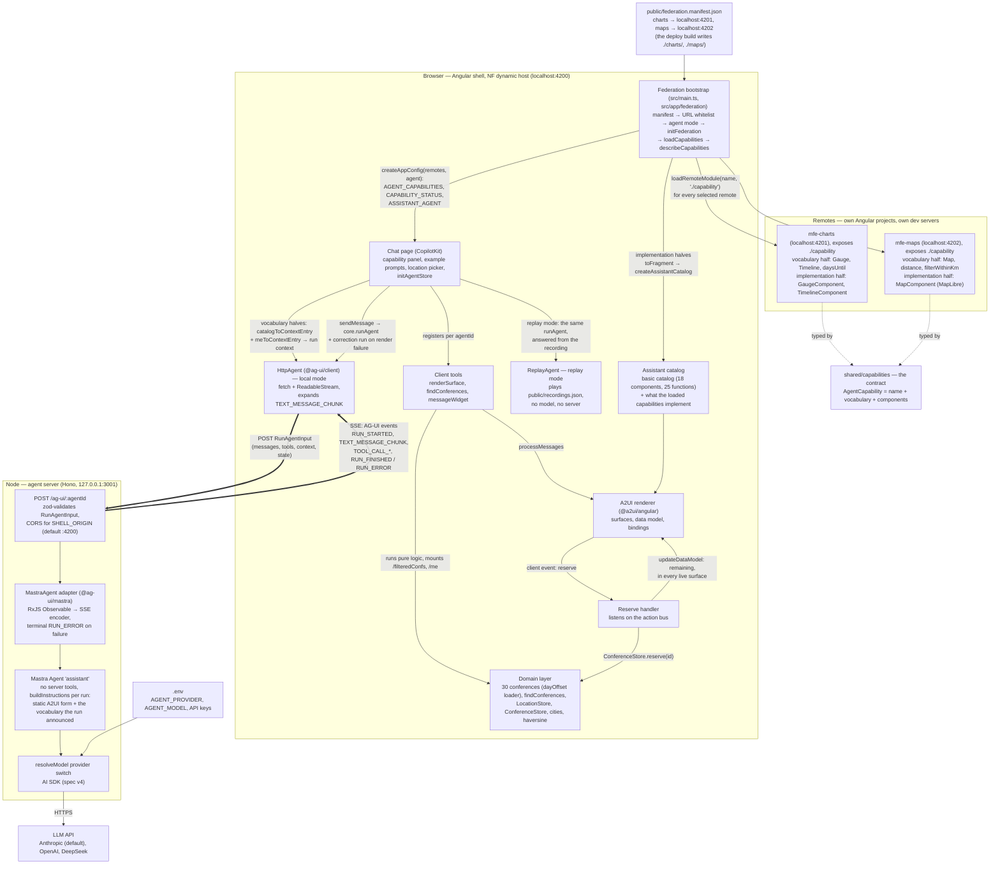
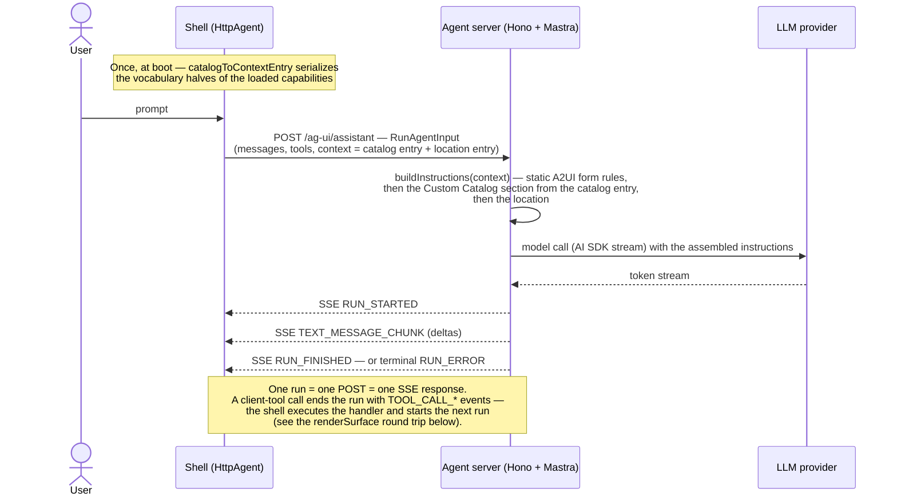
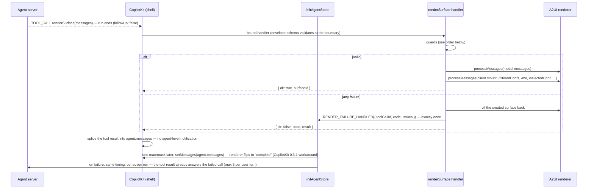

# Architecture

The request decides which inputs/outputs are composed and how they are wired;
the vocabulary decides what is possible; Native Federation decides who delivers
vocabulary. An AG-UI agent answers conference questions, and the answer is
rendered as an A2UI surface built from a component vocabulary that remotes
contribute at runtime, rather than from hand-written screens.

This document is the reference: dense on purpose, meant to be searched rather
than read top to bottom — by whoever changes the code next, human or coding
agent. For the idea behind it, read [`docs/how-it-works.md`](./how-it-works.md)
first.

Everything described here exists in the code; what is planned but not built is
named only in *Status and history*. The chat page at `/` is the visual anchor,
with the capability panel in its header; the playground routes stay as dev
sandboxes: `/playground` (catalog components on a hand-built surface) and
`/playground/tools` (the real client-tool pipeline).

## How to read this document

It has three parts. *Big picture* is the map. *At runtime, in order* follows the
app from page load through one chat turn, then through the two things that need
no model: a click on a finished surface, and a turn answered from a recording.
The rest is lookup material: who owns which layer and which styling zone, what
must stay true while you change code, how the deployed site differs from the
development setup, how model behaviour is measured, and where the project
stands.

| You want to know | Read |
| --- | --- |
| Which parts exist, and where the components come from | [Big picture](#big-picture) |
| What happens before the first message | [Boot](#boot-the-shell-loads-its-remotes) |
| What happens when the user sends a message | [One chat turn](#one-chat-turn-in-plain-words), then its two details: [One AG-UI run](#one-ag-ui-run) and [The renderSurface round trip](#the-rendersurface-round-trip) |
| What a click does, and how a reservation reaches the gauge without the model | [A click, without the model](#a-click-without-the-model) |
| How the hosted demo answers without a server or a key, and how its answers were recorded | [Agent modes: local and replay](#agent-modes-local-and-replay), then the rules under [Replay and recordings](#replay-and-recordings) |
| Which package does what, and which of our files patches which upstream gap | [Layers and ownership](#layers-and-ownership) |
| What a team can ship in a remote, and what stays with the shell | [Who ships what](#who-ships-what) |
| Who owns which styling zone, and how the look reaches a remote | [Styling zones](#styling-zones), then the theme rule under [Federation and boundaries](#federation-and-boundaries) |
| What you must not break | [Invariants worth knowing](#invariants-worth-knowing), grouped by area |
| How the deployed site differs from the development setup | [Development and deployment](#development-and-deployment) |
| How model behaviour is measured | [The eval harness](#the-eval-harness) |
| What is done, what comes next, and where the reasons are recorded | [Status and history](#status-and-history) |

## Big picture

The map: every part that exists, who talks to whom, and the path of the two
halves of a capability — the implementation half into the renderer's catalog,
the vocabulary half through the agent server into the model's prompt.



A remote's `./capability` module is fetched from the remote's origin and runs
inside the shell's page. It is the only thing a host imports from a remote, and
it carries both halves of the capability:

| Capability | Remote | Vocabulary half → the model | Implementation half → the renderer |
| --- | --- | --- | --- |
| `charts` | `mfe-charts`, port 4201 | `projects/mfe-charts/src/charts/vocabulary.ts`: `Gauge`, `Timeline`, function `daysUntil` | `projects/mfe-charts/src/capability.ts`: `GaugeComponent`, `TimelineComponent` |
| `maps` | `mfe-maps`, port 4202 | `projects/mfe-maps/src/maps/vocabulary.ts`: `Map`, functions `distance` and `filterWithinKm` | `projects/mfe-maps/src/capability.ts`: `MapComponent` |

The vocabulary half is framework-free: names, descriptions, prop schemas, and
the catalog functions whole (a function's description and argument schema go to
the model, its implementation into the catalog). The implementation half is the
Angular components. The model gets the vocabulary half alone; the renderer gets
both, joined by `toFragment`: every catalog entry carries name, description and
schema next to its component, and the renderer validates props with that schema. Each remote is also a standalone page — on its own port in development, in
its own folder below the shell in the deployed site — an A2UI host built from
the basic catalog plus exactly its capability, without any shell helper.

## At runtime, in order

Six sections in time order: the boot happens once per page load, the chat turn
is the overview of everything after it, and the next two sections zoom into the
two halves of that turn. The last two cover what needs no model: a click on a
surface that is already on screen, and a turn answered from a recording.

### Boot: the shell loads its remotes

Once per page load, before Angular starts (`src/main.ts`). What this decides is
fixed for the app's lifetime.

1. Fetch `federation.manifest.json` — the ceiling of what this deployment can
   load. Here it is a static file in `public/` that the deploy build replaces
   (see *Development and deployment*); an endpoint could serve it just as well.
   If it is unreachable the manifest counts as empty.
2. `selectCapabilities` narrows it to the `?capabilities=` whitelist (invariant
   *The manifest is the ceiling, the URL a whitelist*).
3. `resolveAgentMode` decides who will answer the chat: `?agent=local|replay`,
   otherwise the build's default. Only replay needs data, so only then
   `recordings.json` is fetched and parsed here (see *Agent modes: local and
   replay*).
4. `initFederation(selected)` installs the import map. Only now can the browser
   resolve shared packages such as Angular, so `main.ts` imports nothing from
   `@angular/*`; Angular enters through the dynamic `import('./bootstrap')` at
   the end.
5. `loadCapabilities` imports `./capability` from every selected remote in
   parallel, each with a 15 s timeout, and checks the delivered shape at runtime.
   A remote that stalls, fails or exposes no usable capability is logged and
   left out — the shell still starts with the remaining vocabulary.
6. `describeCapabilities` yields one `CapabilityStatus` per manifest entry:
   `loaded` (with the origin the orchestrator reports), `unreachable` or
   `unselected`. Three states on purpose: a remote that failed must not look
   like one that was switched off in the URL.
7. `createAppConfig(remotes, agent)` turns both decisions into providers:
   `AGENT_CAPABILITIES` (the loaded remotes, for the catalog and the model
   context), `CAPABILITY_STATUS` (every entry, for the capability panel) and
   `ASSISTANT_AGENT` (the agent the mode implies). The panel's links reload the
   app with one remote flipped in the URL; next to a loaded remote's origin a
   second link opens that remote's standalone page.

The shell is wired in that one function: everything app-wide is an
`EnvironmentProviders` function listed there. A listener nobody injects — the
reserve handler — is an environment initializer rather than a service, because
a root service is only created on first injection.

Not switched on: subresource integrity. Native Federation can hash what a remote
delivers (`features.integrityHashes`, manifest entries with an `integrity`
value); all three `federation.config.mjs` files leave it off.

### One chat turn, in plain words

The whole turn in six steps, told for the local mode. *One AG-UI run* below is
the detail of steps 1–2, *The renderSurface round trip* the detail of steps 3–6.
In replay mode a recording takes the place of steps 1–2; steps 3–6 are the same
code.

1. The user asks — CopilotKit sends the prompt through our agent server to
   the LLM, together with the vocabulary of the loaded capabilities.
2. The LLM answers: "call `renderSurface` with these messages." It knows only
   tool names and schemas and the vocabulary this run announced — nothing else
   of our world.
3. CopilotKit looks the name up in its registry and finds our handler plus our
   display component — both handed over once, at registration
   (`createFrontendTool`).
4. The handler validates the messages, builds the surface in the root renderer
   service, and mounts our data behind the bound paths.
5. CopilotKit places the display component at the tool call's spot in the chat
   transcript: "Building surface …" while streaming, then the surface — or the
   error text.
6. The turn ends (`followUp: false`). On failure, `RENDER_FAILURE_HANDLER`
   carries the one signal; `initAgentStore` starts the correction run once the
   failed call has its result — the tool result itself tells the model what
   went wrong. Three corrections per user turn, then the shell stops.

### One AG-UI run

Steps 1–2 in detail: what travels to the agent server and how the prompt comes
about. The vocabulary section of the system prompt is not written anywhere: the agent
server assembles it per run from the context the shell sends. The same request
is therefore a different run per capability set.

The model learns three things from three sources. The static part of the prompt
(`agent/src/prompt.ts`) teaches A2UI form. The `context` field carries the
vocabulary of the loaded capabilities and the user's location. The `tools` field
carries the client tools CopilotKit registered (`renderSurface`,
`findConferences`, `messageWidget`: name, description, parameter schema); the
`@ag-ui/mastra` adapter hands them to Mastra as `clientTools`, so the model sees
them as tool definitions, never as prompt text.



What the model reads under `# Custom Catalog`, per shell URL:

| URL | Loaded | The section lists |
| --- | --- | --- |
| `/` or `/?capabilities=charts,maps` | charts, maps | `Gauge`, `Timeline`, `Map`, `daysUntil`, `distance`, `filterWithinKm` |
| `/?capabilities=charts` | charts | `Gauge`, `Timeline`, `daysUntil` |
| `/?capabilities=` | — | an empty catalog: `components: {}`, `functions: {}` |

The shell always sends a catalog entry, so the prompt's fallback text ("No custom
vocabulary available …") appears only for a client that sends none. Every entry also
carries `basic`: the 18 basic components with the prop names of their schemas, so the
model composes them without guessing a key.

The static part of the prompt tells the model that the vocabulary changes
between conversations and how to answer a request no listed component provides:
a `messageWidget` text that names the missing capability, plus a `renderSurface`
call with the best available representation in the same assistant message. A
name the run did not announce never reaches the screen either way — the shell's
catalog lacks it, so guard 5 below rejects the surface.

### The renderSurface round trip

Steps 3–6 in detail: what the shell does with the model's answer, and what
happens when that answer is wrong.

A tool call whose handler runs entirely in the browser, guarded before anything
mutates, with a single failure signal feeding the correction loop. The two
steps after the handler both live in `initAgentStore`, both deferred by one
macrotask because CopilotKit splices the tool result only after the handler has
returned.



Guard order and failure codes (each also the model-facing feedback):

1. Protocol envelope at the tool boundary — message forms and required fields
   live in the tool schema itself → `invalid_args`.
2. Cross-message checks: exactly one `createSurface`, every message on its
   surfaceId, no `deleteSurface`, id not already taken → `invalid_messages`.
3. Client-owned paths (`/filteredConfs`, `/selectedConf`, `/me`, `/byMonth`,
   `/byTopic`) are never model-written — decided on parsed path segments, so
   `me` equals `/me`, and root writes are forbidden as a whole →
   `forbidden_model_writes`.
4. The selection has one home: a `selected` binding must point at
   `/selectedConf`, and the `id` in a `reserve` event's context at
   `/selectedConf/id` — the reserve handler patches fixed paths, so the shell
   has to know where a selection lives → `invalid_messages`.
5. Component names and function calls must exist in the surface's catalog — the
   basic catalog plus what this shell instance loaded (the renderer would
   silently skip unknown ones) → `catalog`.
6. `processMessages` + client mount run in one try/catch; a throw rolls the
   surface back → `catalog`.

### A click, without the model

Once a surface is on screen, the model is out of the picture: nothing below
starts a run or sends a request. What the user does to a surface reaches one of
three distances.

| The user … | Example | Who reacts | What changes |
| --- | --- | --- | --- |
| makes a component write the path it is bound to | a click on a `Map` marker or a `Timeline` item writes the whole element to `/selectedConf`; a `Slider` writes `/filter/maxKm` | the renderer: every binding on that path re-evaluates | the data model of this surface |
| moves an argument of a function call | `Map.points` bound to `filterWithinKm(points, center, maxKm)`, with `maxKm` on the slider's path | the renderer: it runs the call again whenever a path among its arguments changes | what the component shows — here, fewer or more markers |
| triggers a client event | the `Button` whose `action` is the event `reserve` | a handler in the shell, listening on the action bus | the shell's store, and the data of every live surface |

The first two need no code outside the components and functions a capability
ships: the model wired them when it chose the paths. Only the third leaves the
surface. `reserve` is the one event that exists, and this is its path:

1. The model gave the basic `Button` the action
   `{ event: { name: 'reserve', context: { id: { path: '/selectedConf/id' } } } }`.
   On a click the renderer resolves the context against the surface's data, so
   the event carries the id of whatever is selected at that moment.
2. The renderer hands every client event to the one `actionHandler` it was
   configured with; `provideA2uiCatalog` points that at `A2uiActionBus`, which
   fans the event out to its subscribers. A remote component that was given an
   `action` reaches the same bus through the contract's `dispatchSurfaceAction`.
3. The reserve handler (`src/app/a2ui/reserve-handler.ts`) ignores every other
   event name, reads the id and calls `ConferenceStore.reserve(id)`. The store
   keeps a count per conference id, in memory, so a reload starts fresh; it
   returns the tickets left, never below zero. An id no conference has is
   ignored with a console warning.
4. The handler writes that number back through `renderer.processMessages`, as
   one `updateDataModel` per home of the conference: its entry in
   `/filteredConfs` and, where it is the selection, `/selectedConf/remaining` —
   in every live surface, not only the clicked one.
5. The bindings do the rest: a `Gauge` bound to `/selectedConf/remaining` drops
   by one, in every answer that shows this conference.

The store is the source, a mounted surface a projection of it. `SurfaceDataStore`
joins the last search result with the reservations (`applyReservations`), so a
surface rendered after a reservation mounts the reduced count from the start. A
surface is mounted once, though, so a change while it is up needs both writes:
into the store for surfaces to come, through the renderer for the ones on
screen. The reserve handler is the one place that does both.

### Agent modes: local and replay

Who answers the chat is decided at boot, like the capability set, and stays
fixed for the page's lifetime.

| Mode | The agent behind the chat | Chosen by | Needs |
| --- | --- | --- | --- |
| `local` | `HttpAgent` → the agent server on `127.0.0.1:3001` → the LLM | the default of every build but `deploy`; `?agent=local` | the agent server running, one provider key in `.env` |
| `replay` | `ReplayAgent`, which plays `recordings.json` inside the page | the default of the `deploy` build; `?agent=replay` | nothing — no server, no key |

There is no third mode that calls a model from the browser: a key belongs on a
server, so "your own key" means the local agent server (`.env`, `npm start`).

What can be asked in local mode is what the tools reach. `findConferences`
filters by topic, a date window and the distance from the user's location, and
groups by month or topic; a surface can select, show details and reserve. So
"all Angular conferences within 100 km of me", ".NET conferences in the next 60
days", "the next one near me, with the tickets left" and "reserve a ticket for
the next Angular conference near me" are answered well. Out of reach: a
conference by its name, a city other than the user's, and the user's own
reservations — no tool argument and no mounted path carries them.

Both agents are AG-UI `AbstractAgent`s behind one token, `ASSISTANT_AGENT`,
registered with CopilotKit as a self-managed agent. Everything after the agent
is the same code in both modes — the client tools, the guards, the client
mount, the renderer — so a replayed answer is validated and rendered exactly
like a live one. Nothing but the chrome branches on the mode (`AGENT_MODE`): in
replay a line above the chat says so, the location reads "Recorded in" with the
city and no *Change*, and CopilotKit's "AI can make mistakes" line is hidden.
The Details panel names the mode in every build.

**What a recording is.** One file, `public/recordings.json`:

<!-- prettier-ignore -->
```jsonc
{ "format": 1, "a2ui": "v0.9",              // pins, see "Replay and recordings"
  "capturedAt": "2026-09-29", "city": "dresden",
  "recordings": {
    "charts,maps": {                         // the loaded remotes in manifest order; "" for none
      "Which Angular conferences are coming up in the next six months?": [
        // one entry per run of the model, each the tool calls of that run
        [ { "name": "findConferences", "args": { "topic": "angular", "withinDays": 180 } } ],
        [ { "name": "renderSurface",   "args": { "messages": [ /* A2UI messages */ ] } } ]
      ]
    }
  }
}
```

A cell is addressed by two things, the capability set and the prompt text.
Every set a visitor can reach through the panel is recorded: two remotes make
four sets, four example prompts make sixteen cells. A cell holds what the model
*did* — tool names and parsed arguments — and on playback the real tools run:
`findConferences` searches today's data, `renderSurface` guards the messages
and mounts the data.

**How a turn is played.** `ReplayAgent.run` looks at the capability set this
shell loaded and at the text of the last user message; the transcript before it
is ignored, because every prompt was recorded as the first message of a fresh
conversation. Within a turn, the run to play is counted off the transcript: the
number of assistant messages since that user message, since CopilotKit runs the
agent again after a tool that asks for a follow-up.

- **No cell** — free text, a set without this prompt, a missing or refused
  file: one `messageWidget` that says the question has no recorded answer and
  how to get the live mode.
- **New surface ids per playback.** The shell refuses a surface id it has
  already seen, and a second click plays the same recording, so every playback
  suffixes the recorded ids with the run id.
- **Paced like a model.** The events are known at once; `paceRun` streams them
  at about a fifth of the live pace, with a reasoning message for the pause and
  the tool arguments in chunks, so "Thinking…" and "Building surface …" appear
  as they do live.
- **The location is the capture's.** Replay pins `LocationStore` to the file's
  `city`: a radius the model chose and a conference its text named stay true.

**How recordings are made.** In local mode, `?record` attaches the recorder
(`src/app/replay/recorder.ts`) to the live agent; replay has no such switch.
Whenever the transcript changes while the agent is idle, the recorder derives
the current turn and replaces that one cell in a file it keeps in
`localStorage['conference-finder.recordings']` — the other cells stay, so the
file survives the reload of a set switch. Every write logs the whole file; the
last log entry is what gets pasted into `public/recordings.json`.

- A run is kept only if every tool call in it was answered with `ok`. A refused
  `renderSurface` is dropped: replay has no model that could correct it.
- A turn whose last run was refused is not written at all, so a failed click
  never replaces a good cell.
- One city per file: a page without a city, or in another city than the stored
  file, writes nothing and says why in the console.

The capture itself is a procedure, not a script: restart the agent server after
a prompt change, clear the storage key, then per capability set click each
example prompt after a reload, so that it is the first message. Judge the form
by eye and click again if it is off — a re-click replaces only its own cell.
`src/app/chat/chat.page.recorded.spec.ts` then plays every cell of the committed
file through the real replay agent, chat, tools and renderer, and checks that
none is refused and none sends a request.

## Layers and ownership

Several protocols and toolkits stack on top of each other. The table pins who
owns which layer; the list below it names, per layer, the seam code we wrote and
the verified upstream gap it compensates (where the evidence is recorded: see
*Status and history*).

| Layer | Package(s) | Responsibility | Framework-bound? |
| --- | --- | --- | --- |
| LLM | Anthropic (default), OpenAI, DeepSeek via AI SDK | generate text and tool calls | no |
| Agent runtime | `@mastra/core` | the `assistant` agent in the Node process: instructions, model wiring | no (server-side) |
| Transport | `@ag-ui/core`/`encoder`/`mastra` (server), `@ag-ui/client` (browser) | **AG-UI**: one protocol between any agent backend and any frontend — `RunAgentInput` in, event stream out; the adapter translates Mastra's stream, `HttpAgent` consumes it; in replay mode `ReplayAgent` produces the same events from a recording | framework-free |
| Chat & tools | `@copilotkit/angular` | chat UI, agent store, frontend-tool registration on top of AG-UI | Angular binding |
| Surface protocol | `@a2ui/web_core` | **A2UI**: surface messages, data model, path bindings, the catalog contract (name + schema); even its reactivity is neutral (`@preact/signals-core`) | framework-free |
| Surface renderer | `@a2ui/angular` | binds the catalog contract to Angular components (`BoundProperty` signals, `a2ui-v09-surface`) | Angular binding |
| Vocabulary | `shared/capabilities/` (contract), `projects/mfe-charts/`, `projects/mfe-maps/` (the capabilities), `src/app/a2ui/` (merge + model context) | the assistant catalog: framework-free metadata (`*.schema.ts`, catalog functions) + Angular implementations, contributed per remote | split on purpose |
| Map drawing | `maplibre-gl`, inside `mfe-maps` only; vector tiles, style and glyphs from OpenFreeMap | the WebGL basemap, the markers and the collision-avoiding labels behind the `Map` component. Library, stylesheet and worker ship with the remote; the shell imports none of it. No key, no account | no — the remote wraps it in an Angular component |
| Federation | `@angular-architects/native-federation-v4`, `@softarc/native-federation-orchestrator` | **Native Federation**: load a remote's ES module at runtime through an import map and negotiate the shared packages | runtime framework-free, Angular builder |

Our seam code, per layer, and why it exists (the LLM layer has none, the
Vocabulary layer is our code as a whole):

- **Agent runtime**
  - `resolveModel` — the `.env`-driven provider switch.
  - `buildInstructions` — the adapter parks the run's AG-UI context under the
    `ag-ui` key and nothing in Mastra reads it, so the prompt is assembled from
    it per run (dynamic `instructions`, resolved on every `getInstructions`).
- **Transport**
  - The route zod-validates `RunAgentInput` and pins CORS to `SHELL_ORIGIN`.
  - The shell pins `@ag-ui/*` to CopilotKit's exact version (one `AbstractAgent`
    class).
  - A `uuid` browser-build alias in the test runner.
  - `ReplayAgent` and `paceRun` — the second agent behind the same interface,
    for a site without a server (see *Agent modes: local and replay*).
- **Chat & tools**
  - `createFrontendTool`/`bindFrontendTool` — CopilotKit only JSON-parses tool
    args, so the boundary validates here; adds the turn-end suffix and routes
    boundary rejections into `RENDER_FAILURE_HANDLER`.
  - `initAgentStore` — registers tools and context for one agent, re-publishes a
    turn-ending tool's result to the store (CopilotKit splices it in silently),
    and defers the correction run until that result exists.
- **Surface protocol**
  - The `renderSurface` guards — the wrapper schema validates messages only one
    by one, so the cross-message rules (one fresh surface, no `deleteSurface`,
    segment-based forbidden writes, rollback on failure) live in the handler.
- **Surface renderer**
  - `provideA2uiCatalog` — action-bus wiring plus the `MarkdownRenderer` the
    basic `Text` injects but `provideA2Ui` does not provide.
  - `A2uiActionBus` — the renderer takes exactly one action handler, fixed when
    it is provided; the bus lets the reserve handler and the playground
    subscribe afterwards.
  - `createCustomComponent`/`createCatalogFunction` — the two documented
    zod-universe bridge casts; add the `description` their `ComponentApi` lacks.
  - `patches/@a2ui+angular+0.10.5.patch` — the basic `Text` of that release
    renders a bound `0` as nothing ("0 km" in the user's own city). The line is
    patched in place; `postinstall` runs `patch-package`, so the patch is an
    install step until a release carries the upstream fix.
- **Map drawing**
  - `MAP_RESOURCES` — MapLibre loads its style and its worker from outside the
    bundle; the token is the one seam for both. The worker files are copied
    into the remote's output as assets under `maplibre/`, because no bundler
    follows the library's own worker import.
  - `recolour` — takes OpenFreeMap's `positron` style as it is and replaces only
    the colours; no cartography is redrawn.
- **Federation**
  - The two-phase bootstrap (`src/main.ts` → `src/bootstrap.ts`).
  - `selectCapabilities` — the URL whitelist.
  - `loadCapabilities` — timeout plus a runtime shape check, because the
    contract's compile-time pairing of names and implementations cannot cross
    the federation boundary.
  - `describeCapabilities` — the three states the panel shows.
  - `scripts/build-deploy.mjs` — assembles the static site and writes its
    manifest (see *Development and deployment*).

How they interlock: A2UI never touches the wire on its own — it rides **inside**
AG-UI, as the arguments of the `renderSurface` client tool call. CopilotKit
renders the chat transcript and routes the tool call to our handler, which
validates the A2UI payload and hands it to the `@a2ui/angular` renderer; the
surface then appears inline in the chat as that tool call's rendering. The
model authors only the structure — the data behind the bound paths is mounted
by the client (see the invariants below).

CopilotKit does ship its own A2UI path (a built-in `render_a2ui` tool on a Lit
renderer). We bypass it deliberately — our tool is `renderSurface` on
`@a2ui/angular` — and the tool names `render_a2ui` and `AGUISendStateSnapshot`
stay reserved to CopilotKit.

### Who ships what

What a team can put into a remote, and what stays with the shell. A capability
has two halves, and they cover two of the three things a UI does.

| A capability can … | Shipped by | Through | Here |
| --- | --- | --- | --- |
| **render** — components | a remote | `vocabulary.components` to the model, `components` to the renderer | `Timeline`, `Gauge`, `Map` |
| **compute** — catalog functions | a remote | `vocabulary.functions`: the description to the model, the implementation to the renderer | `daysUntil`, `distance`, `filterWithinKm` |
| **react** — handlers for client events | the shell only | no contract half; `provideReserveHandler()` in the shell's app config | `reserve` |

Interaction does not need a handler. A component that writes a bound path and a
function that reads it are rendering and computing, so a remote can ship a
working control: the distance slider is the basic `Slider` plus the maps
remote's `filterWithinKm`, and no code reacts to it.

Reacting is shell-only because of where the `reserve` effect lands: in data
another owner mounted (`/filteredConfs`, `/selectedConf`) and in the shell's
store. A remote component may dispatch an event, but what the event means is
the shell's decision. A remote could own the reaction as well — handlers as a
third half of the contract, registered on the action bus when the capability
loads — once three things hold: the host offers a narrow API for writing into
surfaces, the event and its context are announced in the vocabulary like
components and functions, and the effect stays in that team's own backend.

### Styling zones

One look ("Departure": an ink header band, mono numerals for every date,
distance and count, blue for the line and the selection, amber for attention
only) across zones that different owners render. The look is a set of custom
properties, `--cf-*`, declared once in `shared/theme/tokens.css`; every zone is
reached through its owner's own variables or classes, never by restyling a DOM
the owner may change.

| Zone | Rendered by | The theme reaches it through |
| --- | --- | --- |
| Shell chrome: header band, location picker, prompt row, capability panel, and the two chat-side renderers (`app-message-widget`, `app-surface-tool-renderer`) | shell components | their own component stylesheets, on `--cf-*` |
| Chat frame: bubbles, message input, the "Thought for…" line | `@copilotkit/angular` | CopilotKit's theme variables under `[data-copilotkit]`, the class inputs `copilot-chat` forwards, and global rules on its rendered elements — `src/theme/copilotkit.css` |
| Agent primitives: `Column`, `Row`, `Card`, `Divider`, `Text`, `Button` | `@a2ui/angular` | the `--a2ui-*` variables mapped to the tokens on `:root`, plus the few rules those variables do not reach — `src/theme/a2ui.css`; which primitives an answer arranges is the model's choice |
| Widgets: `Timeline`, `Gauge` | `mfe-charts` | inside the component, as private aliases of `--cf-*` (see *Federation and boundaries*) |
| `Map` | `mfe-maps`, drawn by MapLibre | two ways. Frame and markers are DOM: private aliases of `--cf-*` inside the component, every rule scoped under `.cf-map` with `ViewEncapsulation.None`, because MapLibre builds its own DOM and its stylesheet comes along. Basemap and point labels are painted inside the WebGL canvas, where custom properties do not reach: their colours are literals in `maps/map-style.ts` |

`src/styles.css` is the shell's manifest: the tokens, then the A2UI zone, then
the CopilotKit zone, in cascade order. CopilotKit's own stylesheet loads before
it (`angular.json`), so the shell's unlayered variable block wins by order; the
header of `src/theme/copilotkit.css` documents that. A remote's standalone page
imports the token file only; what it needs of a zone it re-declares (the charts
page carries two of the shell's Row rules).

## Invariants worth knowing

Each rule is stated once, here, grouped by the area you are about to change.

### Prompt and vocabulary

What the model may know, and where it learns it.

- **The server holds no vocabulary.** It teaches A2UI *form* — the prompt carries
  the message envelope, the binding syntax and two worked examples built from
  basic components only — but never learns which components exist: that reaches
  the model only through the catalog context entry the browser sends per run.
  `agent/src/prompt.spec.ts` guards it: the prompt built without a catalog entry
  names no custom component or function. Surfaces are built by the model and
  rendered in the browser via the `renderSurface` client tool; no server tool
  touches a surface.
- **The basic catalog is announced by prop names only.** The custom components
  travel with their full JSON schemas (about 14 000 characters for three); the 18
  basic components travel as name plus prop names under `basic` (about 1 000
  characters). The cut follows the cost of the two failure kinds: an unknown key
  such as `Slider.step` costs a whole correction run, a wrong type inside a known
  prop is corrected from the validation issue the tool result carries. The full
  basic schemas would add about 82 000 characters to every request; a lookup tool
  that returns one schema on demand would cost a model round per lookup. Which of
  the three fits is a use-case decision — how many basic components the answers
  need against how much context the model may carry.
- **The browser owns the data, the model only binds to it.** The client mounts
  `/filteredConfs`, `/me` (and derived views) into the surface data model — the
  `renderSurface` handler does it with `updateDataModel` messages when the
  surface is created; the model binds paths instead of transcribing values.
  These paths are never written by the model.
  `/filteredConfs` holds the latest search result when the surface is created;
  `/selectedConf` holds that surface's selection, initially the first result.
  The selection's path is fixed, not chosen by the model, so a handler in the
  shell can find it. Paths outside that set, such as `/filter/maxKm` for a
  slider, are the model's to name and to initialise.
- **A prop is a literal, a path or a function call.** The contract's `binding()`
  accepts all three shapes for every custom prop, because the renderer validates
  each custom prop against its schema: without the call shape a `Map` whose
  `points` are computed by `filterWithinKm` would be rejected.
- **Announced schemas carry no `$ref`.** `catalogToContextEntry` writes every
  alternative out. The serializer's default would point a repeated shape at a
  position inside the same schema, and that pointer dangles once the schema is
  nested into the catalog entry.
- **One enumeration per capability.** A remote's `vocabulary.ts` names the
  components and functions it contributes; its `capability.ts` pairs the same
  names with Angular components, and the shell's `catalog-context.ts` serializes
  them for the model. Both halves are keyed by one name union, so an announced
  component without an implementation (or the reverse) is a compile error inside
  the remote; `loadCapabilities` repeats the check at runtime for what arrives
  over the federation boundary. Which capabilities are loaded is decided by the
  federation bootstrap (`createAppConfig(remotes)`), never by an import in the
  shell; `AGENT_CAPABILITIES` is where the rest of the app reads that list.

### Surfaces and tools

The path of a `renderSurface` call. Most of these compensate a verified CopilotKit behaviour, so re-check them on an upgrade.

- **The tool boundary validates because CopilotKit does not.** CopilotKit only
  JSON-parses tool arguments; the schema in `parameters` never runs. Every tool
  therefore goes through `createFrontendTool`, whose bound handler parses the
  arguments before any tool code sees them.
- **One fresh surface per call.** The model never edits or deletes an existing
  surface: `deleteSurface` is rejected, taken surfaceIds are refused. Surfaces
  in the chat history stay immutable.
- **An answer's structure is the record, its data is the browser's.** The text
  and the components of an answer never change. The data behind its bindings
  does, in two ways: what answered the request — the search result in
  `/filteredConfs` — is mounted once and stays with that answer, while shared
  state the user changes — the tickets left after a reservation — is written
  into every live surface that shows it.
- **Exactly one failure signal per failed call.** `followUp` is static, so a
  failed `renderSurface` cannot ask for a correction itself;
  `RENDER_FAILURE_HANDLER` fires exactly once per failure (boundary rejections
  included) and is the whole correction channel.
- **A correction run answers the failed call first.** `RENDER_FAILURE_HANDLER`
  fires inside the failing tool call, before CopilotKit has spliced the tool
  result into the transcript; `initAgentStore` defers the correction run until
  that result exists, so the model never sees an unanswered tool call (specs in
  `src/app/chat/chat.page.spec.ts` pin the order). Failures of one run share one correction, and
  three corrections per user turn are the budget — each is a top-level run,
  outside CopilotKit's follow-up depth limit.
- **Turn-ending tool results reach the store by hand.** CopilotKit splices a
  tool result into `agent.messages` without an agent-level notification, so
  after a `followUp: false` tool the agent store — and the tool renderer's
  status — would only catch up on the next run. `initAgentStore` re-publishes
  the messages after `onToolExecutionEnd`.

### Federation and boundaries

What keeps a remote loadable, replaceable and movable.

- **The manifest is the ceiling, the URL a whitelist.** `?capabilities=charts,maps`
  can only narrow `federation.manifest.json`, never add a remote the manifest
  does not carry: no parameter keeps every entry, an empty one keeps none,
  unknown names are ignored. The URL is the selection's only source — no
  localStorage, no in-app state — so it stays visible, shareable and
  unit-testable, and switching a remote is a reload. Manifest order is kept
  because it decides who wins a duplicate name: first registration wins, by the
  same rule in the catalog merge and in the context serializer, so the announced
  schema is the rendered one.
- **Three module boundaries, checked by `npm run lint`.** The shell imports the
  contract and `shared/agent-contract.ts`, never a remote's source. A remote
  imports the contract only — not the shell, not another remote, not the agent
  contract. The contract imports nothing of ours. `sheriff.config.ts` is the
  executable form; Sheriff walks from the production entry points, so the rules
  bind production code and a shell spec may import a remote's source as a
  fixture. The package half lives in `eslint.config.js`: remote production code
  may not import `@copilotkit/*` or `@ag-ui/*` — a remote is an A2UI capability,
  not an agent client.
- **One Angular for shell and remotes.** The renderer creates a remote's
  components inside the shell's component tree, so they share its injector and
  change detection. All three federation configs therefore share Angular as
  `singleton` with `strictVersion`; a second Angular instance would mean a
  second DI tree and no binding across the boundary. The price is that shell and
  remotes upgrade Angular in step.
- **Remotes stay repo-portable.** A remote depends on the contract folder and on
  published packages, on nothing else, so it could move into its own repository
  on its own server tomorrow — the boundaries above exist to keep that true.
  That is why `mfe-maps` carries its own haversine copy (`maps/geo.ts`) instead
  of importing the shell's domain layer; the specs pin both copies to the same
  measured distance. What the single workspace simplifies
  compared with that real shape is argued once, in
  [`how-it-works.md`](./how-it-works.md#the-monorepo-is-a-simplification).
- **The theme crosses the boundary as custom properties, never as CSS.**
  `shared/theme/tokens.css` declares `--cf-*` on `:root`; the shell's stylesheet
  and each remote's standalone stylesheet import it, and a remote never imports
  host CSS (the A2UI and CopilotKit zone files are the shell's). A remote
  component reads the tokens as private aliases whose fallback is the token's
  own value (`--_rail: var(--cf-rail, #2b5fa8)`), so it renders the Departure
  look even in a host that declares no `--cf-*` — the styling form of *Remotes
  stay repo-portable*. A bare colour, radius or font in a remote component is
  therefore only ever a `var()` fallback.
- **The capability contract is `shared/capabilities/`.** It is this project's own
  contract, not part of A2UI or AG-UI. Everything a remote needs
  to describe a capability (`AgentCapability`, `CapabilityVocabulary`, the
  schema helpers, `dispatchSurfaceAction`) lives there; the shell keeps only
  the merge (`assistant-catalog.ts`) and the model context. The Node rule holds
  per file, not per folder: `surface-action.ts` needs Angular at runtime, and
  an ESM import evaluates every module a barrel re-exports (tree-shaking is a
  bundler step, Node has none), so there is no `index.ts` and a `vocabulary.ts`
  must never reach it.
- **The shell/agent/eval contract is one file.** Agent id, port, route shape and
  the two context-entry descriptions live in `shared/agent-contract.ts`, which
  all three projects import; it stays import-free because it has to load under
  three module resolutions (Angular bundler, the agent's `nodenext`, eval). The
  specs that assert the literal values are the place where a rename is decided.

### Transport and server

The wire between the browser and the agent server.

- **The wire carries chunks.** Assistant text arrives as `TEXT_MESSAGE_CHUNK`;
  the expansion to `TEXT_MESSAGE_START/CONTENT/END` happens in the client's
  `runAgent` pipeline, not on the wire (verified with a transport probe against the running server).
- **Every run terminates.** A failed run ends with an in-stream `RUN_ERROR`
  event, never with a truncated response.
- **One `@ag-ui` version in the shell.** CopilotKit 0.3.1 pins
  `@ag-ui/client`/`core` to an exact version and checks `instanceof HttpAgent`;
  the shell pins the same version so a single `AbstractAgent` class exists.
- **Loopback only, CORS on top.** The agent binds to `127.0.0.1` — CORS
  restricts browsers, not access; without the bound host any LAN peer could
  spend the API key.

### Replay and recordings

What keeps `public/recordings.json` playable.

- **A recording holds structure, never data.** No tool result, no conference,
  no date: the conferences are mounted at playback from today's data, so a
  recording made once stays true while the dates move — as long as no date is
  written into a text. `src/app/replay/recordings-file.spec.ts` guards the
  committed file: no date literal, only the three client tools, and every
  answer starts by fetching its own data with `findConferences`.
- **The file is versioned, the vocabulary is not.** Words and components come
  from the same objects at runtime, so the vocabulary needs no version. A stored
  answer does: it is bound to the A2UI message envelope and to the file's own
  layout. The file therefore pins `a2ui` and `format`, and `parseRecordings`
  refuses a file with other values, or with a `city` the picker does not offer,
  as a whole — replay then answers every prompt as not recorded instead of
  failing at the first click.
- **Re-capture after any change to what the model saw.** That is an example
  prompt's text, a component's or function's description or schema, the agent
  prompt, or the set of remotes in the manifest. Only the affected cells need a
  new click, in the file's city; the file's `note` repeats the rule where the
  next editor finds it. Nothing in the file detects such a change: it carries
  no catalog version and no hash. A breaking one — a renamed component, a
  changed prop schema — shows at playback, where the guards refuse the
  recorded surface and the visitor sees the error text in its place;
  `chat.page.recorded.spec.ts` catches it earlier, because it plays every cell
  against the remotes' current source. A change of wording alone plays on
  unnoticed.

### Theme and widgets

The look, and the rules the widgets rest on.

- **One light scheme per app.** `color-scheme: only light` stands once, in the
  token file, so the shell and both standalone pages pin it. A2UI's default
  theme pairs `color-scheme: light dark` with `light-dark()` colours, which
  turned surface text near-white on a dark operating system; the app has no
  dark mode, so the scheme is pinned rather than themed twice.
- **The Timeline is one uniformly scaled SVG.** A fixed `viewBox` (832 × 220
  units, the desktop frame's pixels) inside a host that takes the container's
  width, so rail, labels and dates scale together with the svg — text sizes
  are viewBox units, not CSS pixels. Which layout shows, rail or board, is
  decided without measuring the DOM: both are in the markup and CSS shows one,
  either by a container query below 813 px (where a 12-unit label falls under
  11 px) or by `labelsFit`, a pure estimate over items and range in viewBox
  units that sets `data-layout="board"` on the host. Tests and DevTools read
  the layout from that attribute; the gauge's `data-level` has the same shape.
- **The Map selects without a popup.** The selected point gets an ink ring and
  a bold label that is placed first. Labels are a MapLibre symbol layer, so the
  library's collision index keeps them apart; a DOM popup is invisible to that
  index and would cover them.
- **Specs render the real map, offline.** A spec that renders a `Map` provides
  `provideOfflineMap()` (`projects/mfe-maps/src/testing/`): an empty style and a
  worker that never answers, so no style, tile or glyph request leaves the
  page. Test helpers live in `testing/` folders, which `tsconfig.app.json`
  keeps out of the production program — a helper that production code imports
  must live elsewhere.

## Development and deployment

`npm start` runs four processes; the hosted demo is one folder of static files.
The code is the same, the difference is what the boot is handed.

| | Development — `npm start` | Deployed site — `npm run build:deploy` |
| --- | --- | --- |
| Shell | `ng serve` on `localhost:4200` | `dist/deploy/`, served under the base href |
| Remotes | their own dev servers on 4201 and 4202 | `dist/deploy/charts/` and `dist/deploy/maps/`, each with its own `index.html`, `remoteEntry.json` and base href |
| Manifest | `public/federation.manifest.json`, absolute `http://localhost:420x/remoteEntry.json` | written by the script: `./charts/remoteEntry.json`, `./maps/remoteEntry.json` |
| A remote's origin, as the panel shows it | `http://localhost:4201/` | `./charts/` |
| Agent | `local`: the agent server on 3001 | `replay`: `recordings.json` beside the manifest, no server |
| Shell build configuration | `development` | `deploy`, which swaps in `environment.deploy.ts` |

`npm run build:deploy -- --base-href /path/` (default `/`) builds both remotes
and the shell and copies them into one tree: the shell at the root, each remote
in a folder below it. A remote is built with `<base><folder>/` as its base href,
because its standalone page lives there and resolves its own `remoteEntry.json`
against it.

- **The manifest is the only file that knows the layout.** The script replaces
  the copied development manifest with relative URLs. The shell fetches them
  against the document base and the orchestrator keeps the relative scope, so
  no URL is composed in shell code. The `./` prefix is required:
  es-module-shims treats a bare string as a bare specifier.
- **One table drives builds, copies and manifest.** `REMOTES` in
  `scripts/build-deploy.mjs` pairs manifest name, Angular project and folder; a
  third remote is one more row.
- **The script starts with `npm run clean`.** `ng serve` writes its federation
  artifacts into the same `dist` folders the build reads. So it must not run
  beside `npm start`, and the next `npm start` needs a `clean` first.
- **Nothing checks the result automatically.** Serve `dist/deploy` under its
  base path and look: both remotes loaded, the replay line, the four example
  prompts, each remote's standalone page through the panel's link.

## The eval harness

`npm run eval` answers what the test suites cannot: does the model reliably build
a correctly wired surface? It is the second consumer of the framework-free tool
definitions and the context serializer — it plays the browser's part in Node,
which is why `catalog-context.ts` and `surface-host-rules.ts` must not reach
`@a2ui/angular` and why it reads the remotes' `vocabulary.ts` files directly.

Every run plays four cells, each badge as the first message of a fresh session,
as a replayed badge is: with `charts,maps` the timeline badge and the detail badge,
with `charts` the timeline badge and the slider-map badge that no announced
component can serve. The last one passes only if the answer uses nothing outside
the announced vocabulary, names the gap and draws no slider. The slider form and
the comparison badge are judged by eye when they are recorded, not by the gate. It
costs real model calls and is run by hand, never in CI; the README section "The
model-behavior gate" has the commands.

## Status and history

The only section that names milestones, dates and work logs — everything above
describes the code as it is.

- **Built so far.** M1 was a monolith: agent server, domain layer, assistant
  catalog, client tools, chat page, prompt and eval harness. M2 split it: the
  capability contract, catalog and model context composed from a runtime list,
  the shell as a Native Federation dynamic host, `charts` and `maps` as remotes,
  the capability panel, the module boundaries, and the second eval conversation.
- **Eval gate, 2026-09-22 (English demo strings).** 5/5, 5/5 and 5/5 with both
  capabilities; 5/5 and 5/5 with charts only. The map request without maps
  stood at 0/5 on 2026-09-18 while the static prompt's examples still named
  custom components — the reason for the invariant *The server holds no
  vocabulary*. Request 3 needed "Where and when" in English: with "When" alone
  the model answered with a timeline instead of a map in 4 of 10 runs.
- **Eval gate, 2026-09-24 (detail-view section, grouped example).** On the
  2026-09-22 strings request 3 had drifted to 3/5 (the model dropped the `Gauge`
  or the `Map`). A `Map` description that claims "where" and "near me" questions
  brought it back on its own: 5/5, 5/5, 5/5 and 5/5, 5/5, 4/5 in two runs while
  the agent was still serving the old prompt (its watcher had stopped
  reloading). On the final strings — that description, a static section saying
  what a single conference's details show (a `Card` with name, facts and
  button; tickets left and distance, no component named) and a detail example
  with grouped caption/value pairs — 5/5, 5/5 and 5/5 with both capabilities
  and 5/5 and 5/5 with charts only. The grouped example alone, on the drifted
  baseline, had scored 3/5 and 2/5.
- **Eval gate, 2026-09-24 (`formatDate` rule).** The strings above plus one paragraph
  under "Bind, never copy" — dates in the data are ISO and bound directly, `formatDate`
  takes a date-fns pattern — 5/5, 5/5 and 5/5 with both capabilities; 5/5 and 5/5 with
  charts only.
- **Visual language "Departure", 2026-09-25.** One look across shell chrome,
  chat frame, agent primitives, `Timeline` and `Gauge`, carried by the `--cf-*`
  custom properties, plus the one prompt change of the 2026-09-24 gates (grouped
  caption/value pairs); the map followed with M3. The
  spec is [`docs/specs/visual-language.md`](./specs/visual-language.md); each
  visual step was verified by looking at `/playground` and the app at desktop
  and phone width, not by screenshot comparison.
- **M3, 2026-09-26 to 2026-09-30: reserve, map, hosting.** The reserve handler
  and `ConferenceStore`; MapLibre inside `mfe-maps` with the map kit of the
  visual-language spec, minus its popup; the agent modes with `ReplayAgent`;
  the distance filter `filterWithinKm` as a function inside `maps` instead of
  the third remote the spec had sketched; the browser recorder and the sixteen
  recordings, captured in Dresden on 2026-09-29; the deploy script. Two
  decisions shaped it. *A button is a recording*: each example prompt is
  recorded as the first message of a fresh conversation per capability set,
  rather than as a chain of requests. *Four badges, four forms*: the four
  example prompts had converged on one answer, so they were rewritten to a
  timeline, a map with a distance slider, a three-card comparison and the
  detail view with the reserve button, and the prompt gained the section
  "Answer the form asked".
- **Eval gate, 2026-09-29 (four badges, form rules).** Four cells, each badge as
  the first message: 5/5 and 5/5 with both capabilities (timeline, detail view),
  5/5 and 5/5 with charts only (timeline, the slider map that cannot be built).
  One sentence was added to the prompt afterwards (a `ChoicePicker`'s options
  cannot be bound to a list); the run on those strings, the ones the recordings
  were captured with, gave 5/5 and 4/5, 5/5 and 4/5 — one detail view without a
  `Map`, one answer that did not name the missing filter.
- **Not built, by decision.** A mode that calls a model from the browser with
  the visitor's key: a key belongs on a server, so the live alternative is the
  local agent server. A per-conference count of the user's own reservations in
  the data model; [`docs/improvements.md`](./improvements.md) holds both
  variants.
- **Next.** Publication: the README as the front door, the repository history,
  the public repository.
- **Where the reasons are.** The spec is [`docs/spec.md`](./spec.md), the look's
  spec [`docs/specs/visual-language.md`](./specs/visual-language.md). The plans
  and task logs under `docs/work/` record why each decision was taken and hold
  the evidence for every upstream gap named in *Layers and ownership*.
