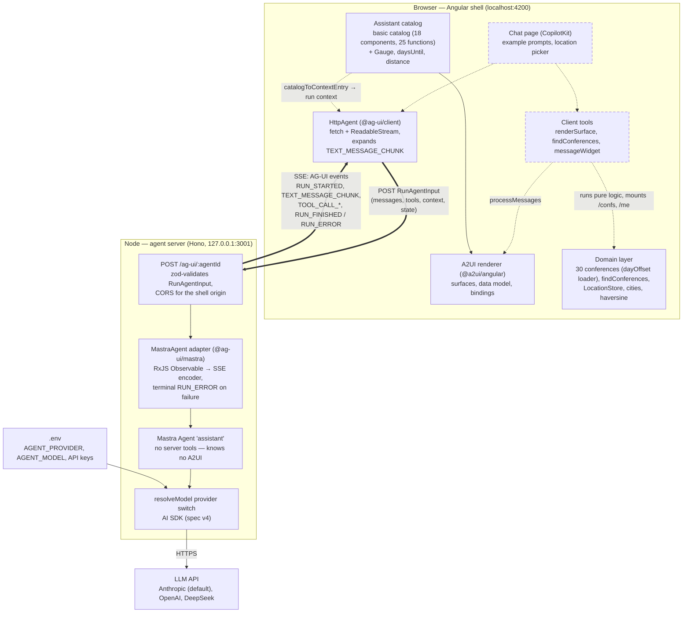

# Architecture — M1 Monolith Spike

The request decides which inputs/outputs are composed and how they are wired;
the vocabulary decides what is possible. An AG-UI agent answers conference
questions, and the answer is rendered as an A2UI surface built from a shared
component vocabulary rather than from hand-written screens. Spec:
[`docs/spec.md`](./spec.md); plan: [`docs/work/m1-spike/plan.md`](./work/m1-spike/plan.md).

Solid nodes and arrows exist today (Tasks 1–4); dashed ones are planned
(Tasks 5–7). Status as of 2026-09-09.

## Big picture



## One AG-UI run

```mermaid
sequenceDiagram
    actor U as User
    participant S as Shell (HttpAgent)
    participant A as Agent server (Hono + Mastra)
    participant L as LLM provider

    U->>S: prompt
    S->>A: POST /ag-ui/assistant — RunAgentInput
    A->>L: model call (AI SDK stream)
    L-->>A: token stream
    A-->>S: SSE RUN_STARTED
    A-->>S: SSE TEXT_MESSAGE_CHUNK (deltas)
    A-->>S: SSE RUN_FINISHED — or terminal RUN_ERROR
    Note over S,A: One run = one POST = one SSE response.<br/>A client-tool call ends the run with TOOL_CALL_* events;<br/>the shell executes the handler and starts the next run.
```

## Layers and ownership

Several protocols and toolkits stack on top of each other; this table pins who
owns which layer:

| Layer | Package(s) | Responsibility | Framework-bound? |
| --- | --- | --- | --- |
| LLM | Anthropic (default), OpenAI, DeepSeek via AI SDK | generate text and tool calls | no |
| Agent runtime | `@mastra/core` | the `assistant` agent in the Node process: instructions, model wiring | no (server-side) |
| Transport | `@ag-ui/core`/`encoder`/`mastra` (server), `@ag-ui/client` (browser) | **AG-UI**: one protocol between any agent backend and any frontend — `RunAgentInput` in, event stream out; the adapter translates Mastra's stream, `HttpAgent` consumes it | framework-free |
| Chat & tools | `@copilotkit/angular` | chat UI, agent store, frontend-tool registration on top of AG-UI | Angular binding |
| Surface protocol | `@a2ui/web_core` | **A2UI**: surface messages, data model, path bindings, the catalog contract (name + schema); even its reactivity is neutral (`@preact/signals-core`) | framework-free |
| Surface renderer | `@a2ui/angular` | binds the catalog contract to Angular components (`BoundProperty` signals, `a2ui-v09-surface`) | Angular binding |
| Vocabulary | `src/app/a2ui/`, `src/app/capabilities/` | the assistant catalog: framework-free metadata (`*.schema.ts`, catalog functions) + Angular implementations | split on purpose |

How they interlock: A2UI never touches the wire on its own — it rides **inside**
AG-UI, as the arguments of the `renderSurface` client tool call. CopilotKit
renders the chat transcript and routes the tool call to our handler, which
validates the A2UI payload and hands it to the `@a2ui/angular` renderer; the
surface then appears inline in the chat as that tool call's rendering. The
model authors only the structure — the data behind the bound paths is mounted
by the client (see the invariants below).

CopilotKit does ship its own A2UI path (a built-in `render_a2ui` tool on a Lit
renderer). We bypass it deliberately — our tool is `renderSurface` on
`@a2ui/angular` — and the tool names `render_a2ui` and `AGUISendStateSnapshot`
stay reserved to CopilotKit.

## Invariants worth knowing

- **The server knows no A2UI.** Surface structure is decided in the browser: the
  model learns the vocabulary through the catalog context entry and emits A2UI
  messages via the `renderSurface` client tool; the server only relays AG-UI
  events.
- **Structure from the model, data from code.** The client mounts `/confs`,
  `/me` (and derived views) into the surface data model; the model binds paths
  instead of transcribing values. These paths are never written by the model.
- **The wire carries chunks.** Assistant text arrives as `TEXT_MESSAGE_CHUNK`;
  the expansion to `TEXT_MESSAGE_START/CONTENT/END` happens in the client's
  `runAgent` pipeline, not on the wire (verified in the Task 4 transport probe).
- **Every run terminates.** A failed run ends with an in-stream `RUN_ERROR`
  event, never with a truncated response.
- **Loopback only, CORS on top.** The agent binds to `127.0.0.1` — CORS
  restricts browsers, not access; without the bound host any LAN peer could
  spend the API key.
- **`src/app/capabilities/**` never imports `src/app/domain/`.** Charts and
  maps become Native Federation remotes in M2; the cut must stay mechanical.
  That is why `capabilities/maps` carries its own haversine copy, pinned to the
  same measured value as the domain's by tests.

## Roadmap context

M1 (this monolith): Tasks 1–4 are done — workspace, agent server, domain layer,
assistant catalog with verified browser transport. Tasks 5–9 add the selection
primitives (`Timeline`, `Map`), the client tools with the surface data store,
the chat page, the `reserve` handler, and the agent prompt with the eval
harness. M2 splits the capabilities into Native Federation remotes, M3 adds the
maps/embed remotes, M4 hosting and replay.
