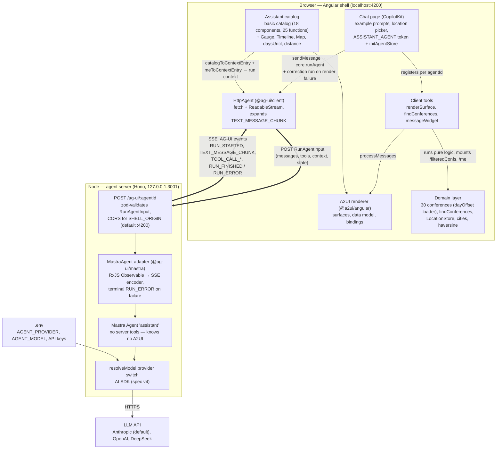
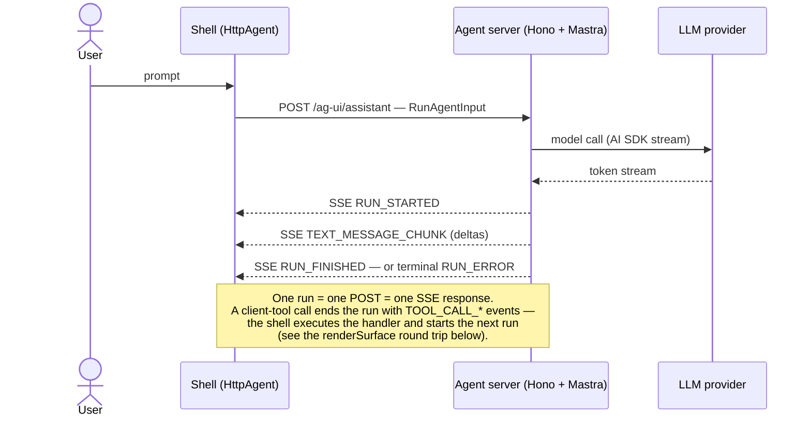
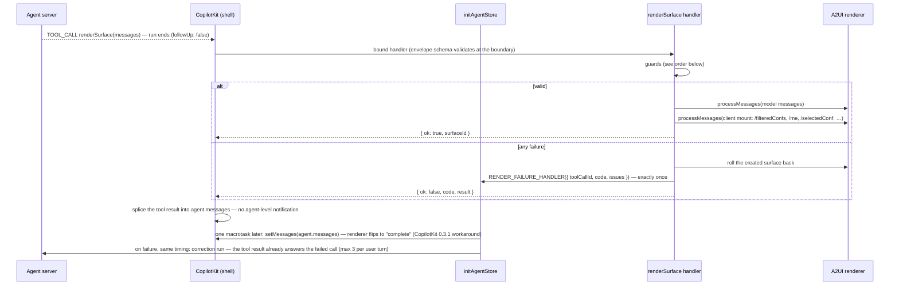

# Architecture — M1 Monolith Spike

The request decides which inputs/outputs are composed and how they are wired;
the vocabulary decides what is possible. An AG-UI agent answers conference
questions, and the answer is rendered as an A2UI surface built from a shared
component vocabulary rather than from hand-written screens. Spec:
[`docs/spec.md`](./spec.md); plan: [`docs/work/m1-spike/plan.md`](./work/m1-spike/plan.md).

Everything drawn exists today (Tasks 1–7). Status as of 2026-09-10. The chat
page at `/` is the visual anchor; the playground routes stay as dev sandboxes:
`/playground` (catalog components on a hand-built surface) and
`/playground/tools` (the real client-tool pipeline).

## One chat turn, in plain words

The whole system in six steps — everything below this section is detail of
steps 3–5.

1. The user asks — CopilotKit sends the prompt through our agent server to
   the LLM (see *One AG-UI run*).
2. The LLM answers: "call `renderSurface` with these messages." It knows only
   tool names and schemas — nothing else of our world.
3. CopilotKit looks the name up in its registry and finds our handler plus our
   display component — both handed over once, at registration
   (`createFrontendTool`).
4. The handler validates the messages (the guard order in *The renderSurface
   round trip*), builds the surface in the root renderer service, and mounts
   our data behind the bound paths.
5. CopilotKit places the display component at the tool call's spot in the chat
   transcript: "Building surface …" while streaming, then the surface — or the
   error text.
6. The turn ends (`followUp: false`). On failure, `RENDER_FAILURE_HANDLER`
   carries the one signal; `initAgentStore` starts the correction run once the
   failed call has its result — the tool result itself tells the model what
   went wrong. Three corrections per user turn, then the shell stops.

## Big picture

## One AG-UI run

## The renderSurface round trip

The one mechanism Task 6 added: a tool call whose handler runs entirely in the
browser, guarded before anything mutates, with a single failure signal feeding
the correction loop. Task 7 added the two steps after the handler — both live
in `initAgentStore`, both deferred by one macrotask because CopilotKit splices
the tool result only after the handler has returned.

Guard order and failure codes (each also the model-facing feedback):

1. Protocol envelope at the tool boundary — message forms and required fields
   live in the tool schema itself → `invalid_args`.
2. Cross-message checks: exactly one `createSurface`, every message on its
   surfaceId, no `deleteSurface`, id not already taken → `invalid_messages`.
3. Client-owned paths (`/filteredConfs`, `/me`, `/byMonth`, `/byTopic`) are
   never model-written — decided on parsed path segments, so `me` equals
   `/me`, and root writes are forbidden as a whole → `forbidden_model_writes`.
4. Component names must exist in the surface's catalog (the renderer would
   silently skip unknown ones) → `catalog`.
5. `processMessages` + client mount run in one try/catch; a throw rolls the
   surface back → `catalog`.

## Layers and ownership

Several protocols and toolkits stack on top of each other; this table pins who
owns which layer — and which of our seam adapters compensates which verified
upstream gap (the task logs under `docs/work/m1-spike/task-log/` hold the
evidence for each):

| Layer | Package(s) | Responsibility | Framework-bound? | Our seam code (why it exists) |
| --- | --- | --- | --- | --- |
| LLM | Anthropic (default), OpenAI, DeepSeek via AI SDK | generate text and tool calls | no | — |
| Agent runtime | `@mastra/core` | the `assistant` agent in the Node process: instructions, model wiring | no (server-side) | `resolveModel` — `.env`-driven provider switch |
| Transport | `@ag-ui/core`/`encoder`/`mastra` (server), `@ag-ui/client` (browser) | **AG-UI**: one protocol between any agent backend and any frontend — `RunAgentInput` in, event stream out; the adapter translates Mastra's stream, `HttpAgent` consumes it | framework-free | route zod-validates `RunAgentInput` and pins CORS to `SHELL_ORIGIN`; the shell pins `@ag-ui/*` to CopilotKit's exact version (one `AbstractAgent` class); `uuid` browser-build alias in the test runner |
| Chat & tools | `@copilotkit/angular` | chat UI, agent store, frontend-tool registration on top of AG-UI | Angular binding | `createFrontendTool`/`bindFrontendTool` — CopilotKit only JSON-parses tool args, so the boundary validates here; adds the turn-end suffix and routes boundary rejections into `RENDER_FAILURE_HANDLER`. `initAgentStore` — registers tools and context for one agent, re-publishes a turn-ending tool's result to the store (CopilotKit splices it in silently), and defers the correction run until that result exists |
| Surface protocol | `@a2ui/web_core` | **A2UI**: surface messages, data model, path bindings, the catalog contract (name + schema); even its reactivity is neutral (`@preact/signals-core`) | framework-free | the `renderSurface` guards — the wrapper schema validates messages only one by one, so the cross-message rules (one fresh surface, no `deleteSurface`, segment-based forbidden writes, rollback on failure) live in the handler |
| Surface renderer | `@a2ui/angular` | binds the catalog contract to Angular components (`BoundProperty` signals, `a2ui-v09-surface`) | Angular binding | `provideA2uiCatalog` (action-bus wiring plus the `MarkdownRenderer` the basic `Text` injects but `provideA2Ui` does not provide); `createCustomComponent`/`createCatalogFunction` (the two documented zod-universe bridge casts; add the `description` their `ComponentApi` lacks) |
| Vocabulary | `src/app/a2ui/`, `src/app/capabilities/` | the assistant catalog: framework-free metadata (`*.schema.ts`, catalog functions) + Angular implementations | split on purpose | — (this layer is our code) |

How they interlock: A2UI never touches the wire on its own — it rides **inside**
AG-UI, as the arguments of the `renderSurface` client tool call. CopilotKit
renders the chat transcript and routes the tool call to our handler, which
validates the A2UI payload and hands it to the `@a2ui/angular` renderer; the
surface then appears inline in the chat as that tool call's rendering. The
model authors only the structure — the data behind the bound paths is mounted
by the client (see the invariants below).

CopilotKit does ship its own A2UI path (a built-in `render_a2ui` tool on a Lit
renderer). We bypass it deliberately — our tool is `renderSurface` on
`@a2ui/angular` — and the tool names `render_a2ui` and `AGUISendStateSnapshot`
stay reserved to CopilotKit.

## Invariants worth knowing

- **The server knows no A2UI.** Surface structure is decided in the browser: the
  model learns the vocabulary through the catalog context entry and emits A2UI
  messages via the `renderSurface` client tool; the server only relays AG-UI
  events.
- **Structure from the model, data from code.** The client mounts `/filteredConfs`,
  `/me` (and derived views) into the surface data model; the model binds paths
  instead of transcribing values. These paths are never written by the model.
  `/filteredConfs` holds the latest search result when the surface is created;
  `/selectedConf` holds that surface's selection, initially the first result.
- **The wire carries chunks.** Assistant text arrives as `TEXT_MESSAGE_CHUNK`;
  the expansion to `TEXT_MESSAGE_START/CONTENT/END` happens in the client's
  `runAgent` pipeline, not on the wire (verified in the Task 4 transport probe).
- **Every run terminates.** A failed run ends with an in-stream `RUN_ERROR`
  event, never with a truncated response.
- **The tool boundary validates because CopilotKit does not.** CopilotKit only
  JSON-parses tool arguments; the schema in `parameters` never runs. Every tool
  therefore goes through `createFrontendTool`, whose bound handler parses the
  arguments before any tool code sees them.
- **One fresh surface per call.** The model never edits or deletes an existing
  surface: `deleteSurface` is rejected, taken surfaceIds are refused. Surfaces
  in the chat history stay immutable.
- **Exactly one failure signal per failed call.** `followUp` is static, so a
  failed `renderSurface` cannot ask for a correction itself;
  `RENDER_FAILURE_HANDLER` fires exactly once per failure (boundary rejections
  included) and is the whole correction channel.
- **A correction run answers the failed call first.** `RENDER_FAILURE_HANDLER`
  fires inside the failing tool call, before CopilotKit has spliced the tool
  result into the transcript; `initAgentStore` defers the correction run until
  that result exists, so the model never sees an unanswered tool call (the
  T7-AC-04 spec pins the order). Failures of one run share one correction, and
  three corrections per user turn are the budget — each is a top-level run,
  outside CopilotKit's follow-up depth limit.
- **Turn-ending tool results reach the store by hand.** CopilotKit splices a
  tool result into `agent.messages` without an agent-level notification, so
  after a `followUp: false` tool the agent store — and the tool renderer's
  status — would only catch up on the next run. `initAgentStore` re-publishes
  the messages after `onToolExecutionEnd`.
- **One `@ag-ui` version in the shell.** CopilotKit 0.3.1 pins
  `@ag-ui/client`/`core` to an exact version and checks `instanceof HttpAgent`;
  the shell pins the same version so a single `AbstractAgent` class exists.
- **Loopback only, CORS on top.** The agent binds to `127.0.0.1` — CORS
  restricts browsers, not access; without the bound host any LAN peer could
  spend the API key.
- **`src/app/capabilities/**` never imports `src/app/domain/`.** Charts and
  maps become Native Federation remotes in M2; the cut must stay mechanical.
  That is why `capabilities/maps` carries its own haversine copy, pinned to the
  same measured value as the domain's by tests.

## Roadmap context

M1 (this monolith): Tasks 1–7 are done — workspace, agent server, domain layer,
assistant catalog, the selection primitives (`Timeline`, `Map`), the client
tools with the surface data store, and the chat page (agent wiring, location
picker, example prompts, scripted-agent loop). Task 9 adds the agent prompt
with the eval harness (the M1 gate); after the v3.3 re-scope the task order is
6 → 7 → 9, and the `reserve` handler moved to M3. M2 splits the
capabilities into Native Federation remotes (charts + maps); M3 adds `reserve`,
the MapLibre upgrade, and hosting with replay publication.
